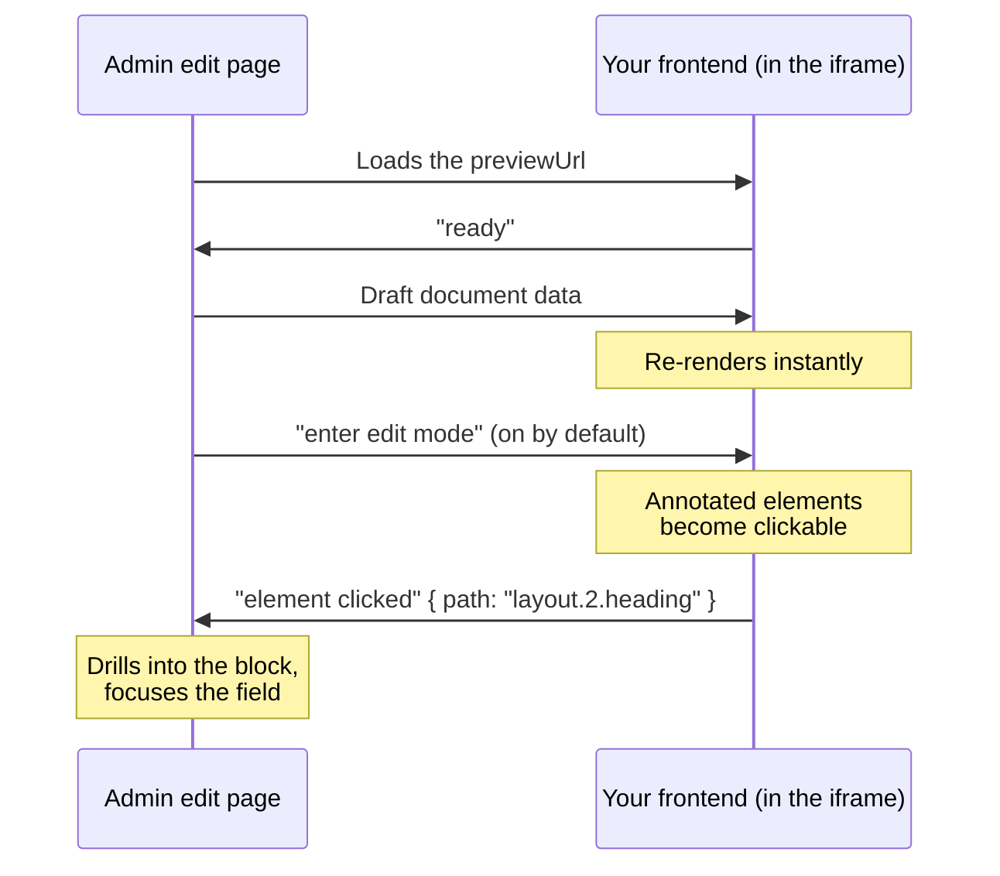

Live Preview puts your rendered site right next to the edit form. As an editor changes a field, the draft flows into an iframe of your frontend and the page re-renders — no save, no reload. Editors can also click an element in the preview and the form scrolls to, and focuses, the exact field behind it.

By the end of this page you should understand what the preview pane does, how the admin and your frontend talk to each other, and the two ingredients you need to turn it on.

## What you get

Set one collection option and two things light up (both covered in [Preview](/docs/editor-experience/preview)):

- A **"View" link** on the list and edit pages that opens the document's real URL in a new tab.
- A **live preview pane** on the edit page: an iframe of your frontend, kept in sync with the form as the editor types.

The pane has its own toolbar — switch between desktop and mobile widths, zoom the desktop view (50/75/100%), reload the frame, or pop it out in a new tab. It opens automatically whenever a document resolves to a preview URL, and hides when it doesn't.

## The two ingredients

Live preview is a handshake between two sides, so it takes two pieces of setup:

1. **Tell the admin where the page lives.** Set `admin.previewUrl` on the collection so Dyrected can turn a document into a URL. This is the [Preview](/docs/editor-experience/preview) configuration — a Jexl string like `"slug ? '/' + slug : null"` is the recommended form.
2. **Teach your frontend to listen.** The pane can show the page, but the *live* part — re-rendering as the editor types — is work your frontend does. It listens for draft data and re-renders with it. That's what the [frontend](/docs/editor-experience/publishing/live-preview/frontend) and [client-side](/docs/editor-experience/publishing/live-preview/client-side) pages cover.

Set the first and you get a working "View" link and a pane that loads your page. Add the second and the pane goes live.

## How the two sides talk

The admin pane and your frontend communicate over [`postMessage`](https://developer.mozilla.org/en-US/docs/Web/API/Window/postMessage) — the browser's built-in channel for sending data between a page and an iframe it hosts. Nothing is saved to the database during preview; the draft is handed straight to the iframe in memory.

The exchange looks like this:

Your frontend never has to implement this protocol by hand. The `useLivePreview` hook (React) and composable (Vue) run the whole exchange for you — see [client-side](/docs/editor-experience/publishing/live-preview/client-side).

## Click-to-edit

The pane starts in **edit mode** (there's a pointer button in the toolbar to turn it off). While it's on, hovering the preview highlights any element your frontend has annotated with a field path, and clicking one tells the admin to focus that field — drilling into a nested block if needed.

You opt an element into this by spreading the result of `useDyPath('fieldName')` onto it. The [client-side](/docs/editor-experience/publishing/live-preview/client-side) page covers `useDyPath` and the `<Blocks>` renderer that scopes paths automatically.

## Same-origin and CORS

Because the draft travels by `postMessage` between the admin page and your frontend iframe, the two sides need to be able to talk. That works when your frontend is same-origin with the admin, or when it's configured to accept the admin's origin. In production, lock the exchange down by passing your admin URL to the hook as `serverURL` instead of accepting messages from any origin — [client-side](/docs/editor-experience/publishing/live-preview/client-side) shows where.

## Where to go next

- [Connecting your frontend](/docs/editor-experience/publishing/live-preview/frontend) — the model behind live data, and the one route that serves both your public page and its preview.
- [Client-side integration](/docs/editor-experience/publishing/live-preview/client-side) — `useLivePreview`, `useDyPath`, and `<Blocks>`, with runnable React, Next.js, Vue, and Nuxt code.
- [Preview configuration](/docs/editor-experience/preview) — `previewUrl` and `previewMode`, and how to keep them working with Dyrected Cloud.
