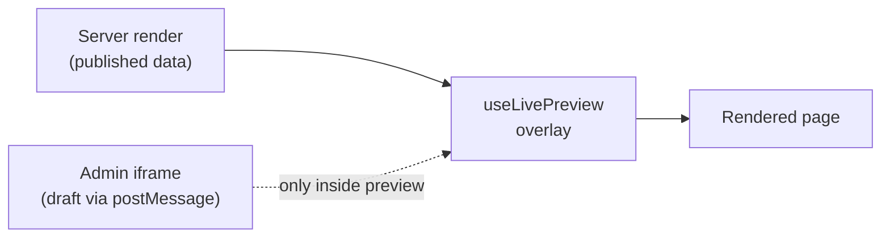

Setting `previewUrl` opens the pane and loads your page, but the page won't *update* as an editor types until your frontend listens for the draft. This page explains the model so the code on the next page makes sense: what "live data" actually is, and why the same route can serve both your public page and its preview.

## The overlay model

Think of your page as rendering data from two sources, one after the other:

1. **On the server**, the page fetches and renders **published** data — exactly what a visitor sees.
2. **In the browser**, `useLivePreview` overlays **draft** data, but only when a `postMessage` arrives from the admin iframe.

Outside the admin, no message ever arrives, so the overlay does nothing and the page renders its published content. Inside the admin's preview pane, the draft streams in and the overlay takes over. That's the whole trick: one component, published by default, live when previewed.

## One route, not two

Because the overlay is inert outside the admin, you don't need a separate `/preview` route. Point `previewUrl` at the page's real URL and let that page use `useLivePreview`. The server only ever sends published data to the public; drafts arrive solely through the in-browser message channel inside the admin.

<Callout type="info">
  A dedicated `/preview` route is worth adding only when you need to keep the public page statically cached while
  previews stay dynamic, or when you want to block the preview path from search crawlers. For most sites, reusing the
  page URL is simpler and safe.
</Callout>

## The three pieces

Your frontend needs three things from Dyrected, and they always come as a set:

| Piece | What it does |
| --- | --- |
| `useLivePreview` | Runs the `postMessage` handshake and returns live `data` that re-renders on every edit. |
| `useDyPath` | Annotates an element with its field path so click-to-edit can map a click back to the form. |
| `<Blocks>` | Renders an array of blocks by type and scopes each block's path automatically, so you never hand-write an index. |

Where you import them from depends on your framework:

| Framework | Import from | Auto-imported? |
| --- | --- | --- |
| Next.js | `@dyrected/next` | No |
| React (Vite/CRA) | `@dyrected/react` | No |
| Nuxt | — | Yes (`useLivePreview`, `useDyPath`, `<DyrectedBlocks>`) |
| Vue (Vite) | `@dyrected/vue` | No |

## Which path: client-side vs server-side

There are two ways the draft can reach your page, and which one you use depends on where your page renders:

- **Client-side (`postMessage`)** — the default. The draft is delivered to the browser and your components re-render there. This gives you **live-as-you-type** updates and **click-to-edit**. Use it whenever your page runs in the browser (which is most of the time).
- **Server-side (`token`)** — for pages that render entirely on the server and can't receive a browser message (a statically generated route, or one you fetch server-side). The admin hands your page a signed token on the URL, and your server redeems it for the draft. It's **refresh-based** (a round-trip per change) and has **no click-to-edit**.

Set the mode with `previewMode` on the collection (see [Preview](/docs/features/admin/preview)); it defaults to `postMessage`.

## Next

- [Client-side integration](/docs/features/live-preview/client-side) — the `postMessage` path: `useLivePreview`, `useDyPath`, and `<Blocks>`, with runnable React, Next.js, Vue, and Nuxt code.
- [Server-side integration](/docs/features/live-preview/server-side) — the `token` path for server-rendered and statically generated frontends.
