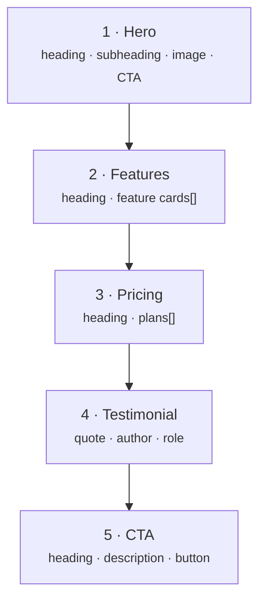
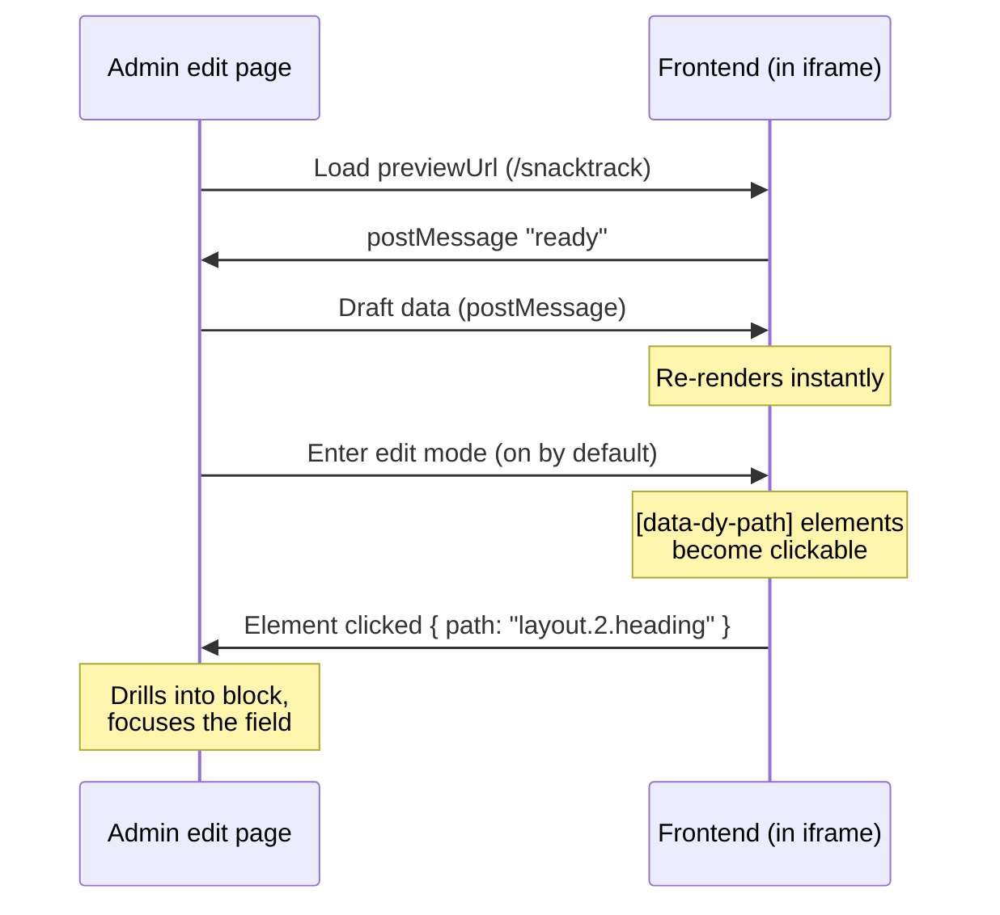

Imagine you're launching **SnackTrack Pro**, a SaaS product. Marketing needs a landing page they can reshape without a developer — swap the hero copy, add a pricing tier, drop in a testimonial — and _see the result as they type_. No publish, no reload, no guessing what the change will look like.

That's live preview. Your frontend renders inside an iframe in the Admin, draft data streams in over `postMessage`, and the page re-renders instantly. With **click-to-edit**, an editor can also click the headline in the preview and the form scrolls to — and focuses — the exact field behind it.

This guide builds that page end to end: a landing page assembled from **five blocks**, wired for real-time preview and click-to-edit.

<Callout type="info">
  New to the `blocks` field itself? Read [Building a Page Builder](/docs/guides/building-a-page-builder) first — it
  covers the schema and rendering basics. This guide assumes you have blocks working and focuses on the *preview*
  experience.
</Callout>

---

## What we're building

A single `pages` document whose `layout` is an ordered list of five block types. Editors add, reorder, and remove them freely.



The five blocks and their fields:

| Block             | Purpose                       | Fields                                                                  |
| ----------------- | ----------------------------- | ----------------------------------------------------------------------- |
| **`hero`**        | Above-the-fold headline + CTA | `heading`, `subheading`, `image`, `ctaLabel`, `ctaLink`                 |
| **`features`**    | Value propositions            | `heading`, `items[]` → `{ icon, title, description }`                   |
| **`pricing`**     | Plan comparison               | `heading`, `plans[]` → `{ name, price, features[], ctaLabel, ctaLink }` |
| **`testimonial`** | Social proof                  | `quote`, `author`, `role`, `initials`                                   |
| **`cta`**         | Closing call to action        | `heading`, `description`, `buttonLabel`, `buttonLink`                   |

---

## Prerequisites

Before wiring preview, make sure the following are in place:

<Callout type="warn">
  Live preview needs a working Dyrected project **and** a frontend route that renders a page. If any box below is
  unchecked, follow the linked setup first.
</Callout>

- [ ] **A Dyrected project** running in Next.js or Nuxt — see [Next.js](/docs/integrations/nextjs) or [Nuxt](/docs/integrations/nuxt).
- [ ] **A database adapter** configured in `dyrected.config.ts` (Postgres, SQLite, etc.).
- [ ] **The Admin UI mounted** (e.g. at `/admin`) and reachable.
- [ ] **Site helpers installed** — `@dyrected/next` (Next.js) or `@dyrected/nuxt` (Nuxt). These give you `useLivePreview`, `Blocks`/`DyrectedBlocks`, and `useDyPath`.
- [ ] **Environment variables** for the API base URL and the Admin origin:
  ```bash
  # Next.js (.env.local)
  NEXT_PUBLIC_DYRECTED_URL=http://localhost:3000
  NEXT_PUBLIC_ADMIN_URL=http://localhost:3000/admin
  SITE_URL=http://localhost:3000
  ```
- [ ] **A public route** that renders a page by slug (e.g. `/[slug]`) — the preview route reuses the same components.

---

## How it works



---

## Build it

<Steps>
<Step>
### Define the page collection and its five blocks

The config is identical for both frameworks. Each block is an object in the `layout` field's `blocks` array.

```ts
// dyrected.config.ts
export default defineConfig({
  collections: [
    {
      slug: "pages",
      admin: {
        useAsTitle: "title",
        // Point this at the page's REAL URL — the same route serves the public
        // page and the preview. A separate /preview route is optional (see the
        // callout in step 3), not required.
        previewUrl: (doc) => (doc?.slug ? `${process.env.SITE_URL}/${doc.slug}` : null),
        previewMode: "postMessage", // default
      },
      fields: [
        { name: "title", type: "text", required: true },
        { name: "slug", type: "text", required: true, unique: true },
        {
          name: "layout",
          type: "blocks",
          blocks: [
            {
              slug: "hero",
              labels: { singular: "Hero", plural: "Heroes" },
              fields: [
                { name: "heading", type: "text", required: true },
                { name: "subheading", type: "textarea" },
                { name: "image", type: "relationship", relationTo: "media" },
                { name: "ctaLabel", type: "text" },
                { name: "ctaLink", type: "url" },
              ],
            },
            {
              slug: "features",
              labels: { singular: "Features", plural: "Feature Sections" },
              fields: [
                { name: "heading", type: "text" },
                {
                  name: "items",
                  type: "array",
                  fields: [
                    { name: "icon", type: "icon" },
                    { name: "title", type: "text", required: true },
                    { name: "description", type: "textarea" },
                  ],
                },
              ],
            },
            {
              slug: "pricing",
              labels: { singular: "Pricing", plural: "Pricing Sections" },
              fields: [
                { name: "heading", type: "text" },
                {
                  name: "plans",
                  type: "array",
                  fields: [
                    { name: "name", type: "text", required: true },
                    { name: "price", type: "text" },
                    { name: "features", type: "array", fields: [{ name: "text", type: "text" }] },
                    { name: "ctaLabel", type: "text" },
                    { name: "ctaLink", type: "url" },
                  ],
                },
              ],
            },
            {
              slug: "testimonial",
              labels: { singular: "Testimonial", plural: "Testimonials" },
              fields: [
                { name: "quote", type: "textarea", required: true },
                { name: "author", type: "text", required: true },
                { name: "role", type: "text" },
                { name: "initials", type: "text" },
              ],
            },
            {
              slug: "cta",
              labels: { singular: "CTA", plural: "CTAs" },
              fields: [
                { name: "heading", type: "text", required: true },
                { name: "description", type: "textarea" },
                { name: "buttonLabel", type: "text" },
                { name: "buttonLink", type: "url" },
              ],
            },
          ],
        },
      ],
    },
  ],
});
```

Restart the dev server, open `/admin`, create a **Page** with slug `snacktrack`, and add the five blocks. You now have content to preview.

</Step>

<Step>
### Render the blocks with click-to-edit

`Blocks` (React) / `<DyrectedBlocks>` (Nuxt) maps each `layout` entry to a component **and** scopes its base path — `layout.0`, `layout.1`, … — automatically. Inside each block component, `useDyPath('heading')` turns that into `data-dy-path="layout.<i>.heading"`. You never write the index yourself.

<Tabs items={['Next.js', 'Nuxt.js']}>
<Tab value="Next.js">

```tsx
// components/page-blocks.tsx
"use client";
import { Blocks } from "@dyrected/next";
import Hero from "./blocks/hero";
import Features from "./blocks/features";
import Pricing from "./blocks/pricing";
import Testimonial from "./blocks/testimonial";
import Cta from "./blocks/cta";

const components = { hero: Hero, features: Features, pricing: Pricing, testimonial: Testimonial, cta: Cta };

export default function PageBlocks({ layout }: { layout: any[] }) {
  return <Blocks items={layout} components={components} path="layout" />;
}
```

```tsx
// components/blocks/hero.tsx
import { useDyPath } from "@dyrected/next";

export default function Hero({ heading, subheading, ctaLabel, ctaLink }: any) {
  return (
    <section className="hero">
      <h1 {...useDyPath("heading")}>{heading}</h1>
      {subheading && <p {...useDyPath("subheading")}>{subheading}</p>}
      {ctaLabel && (
        <a href={ctaLink} {...useDyPath("ctaLabel")}>
          {ctaLabel}
        </a>
      )}
    </section>
  );
}
```

```tsx
// components/blocks/testimonial.tsx
import { useDyPath } from "@dyrected/next";

export default function Testimonial({ quote, author, role }: any) {
  return (
    <figure className="testimonial">
      <blockquote {...useDyPath("quote")}>{quote}</blockquote>
      <figcaption>
        <span {...useDyPath("author")}>{author}</span>
        {role && <span {...useDyPath("role")}>{role}</span>}
      </figcaption>
    </figure>
  );
}
```

</Tab>
<Tab value="Nuxt.js">

`<DyrectedBlocks>` and `useDyPath` are auto-imported by `@dyrected/nuxt` — no import lines.

```vue
<!-- components/PageBlocks.vue -->
<script setup lang="ts">
import { defineAsyncComponent } from "vue";

const components = {
  hero: defineAsyncComponent(() => import("~/components/blocks/Hero.vue")),
  features: defineAsyncComponent(() => import("~/components/blocks/Features.vue")),
  pricing: defineAsyncComponent(() => import("~/components/blocks/Pricing.vue")),
  testimonial: defineAsyncComponent(() => import("~/components/blocks/Testimonial.vue")),
  cta: defineAsyncComponent(() => import("~/components/blocks/Cta.vue")),
};

defineProps<{ layout: any[] }>();
</script>

<template>
  <DyrectedBlocks :items="layout" :components="components" path="layout" />
</template>
```

```vue
<!-- components/blocks/Hero.vue -->
<script setup lang="ts">
defineProps<{ heading: string; subheading?: string; ctaLabel?: string; ctaLink?: string }>();

const dyHeading = useDyPath("heading");
const dySubheading = useDyPath("subheading");
const dyCta = useDyPath("ctaLabel");
</script>

<template>
  <section class="hero">
    <h1 v-bind="dyHeading">{{ heading }}</h1>
    <p v-if="subheading" v-bind="dySubheading">{{ subheading }}</p>
    <a v-if="ctaLabel" :href="ctaLink" v-bind="dyCta">{{ ctaLabel }}</a>
  </section>
</template>
```

```vue
<!-- components/blocks/Testimonial.vue -->
<script setup lang="ts">
defineProps<{ quote: string; author: string; role?: string }>();
const dyQuote = useDyPath("quote");
const dyAuthor = useDyPath("author");
const dyRole = useDyPath("role");
</script>

<template>
  <figure class="testimonial">
    <blockquote v-bind="dyQuote">{{ quote }}</blockquote>
    <figcaption>
      <span v-bind="dyAuthor">{{ author }}</span>
      <span v-if="role" v-bind="dyRole">{{ role }}</span>
    </figcaption>
  </figure>
</template>
```

</Tab>
</Tabs>

The `features` and `pricing` blocks follow the same pattern for their scalar fields (e.g. `useDyPath('heading')`). Their repeatable `items`/`plans` are still editable — `<Blocks>` also puts a **block-level** `data-dy-path` on each block, so clicking anywhere inside a block drills the editor into it, where the array rows live.

<Callout type="info">
  Reuse these exact components for your public `/[slug]` route too. The only
  difference between the live page and the preview is where the data comes from
  (next step) — the markup and `useDyPath` annotations are identical.
</Callout>
</Step>

<Step>
### Wire the page for preview (same URL — no separate route)

Point `previewUrl` at the page's real URL (step 1 already does) and have that page use `useLivePreview`. The **same route serves both** the public page and the preview:

- Server-side, the page fetches **published** data → what visitors see.
- `useLivePreview` swaps in **draft** data only when a `postMessage` arrives from the Admin iframe. Outside the Admin, none arrives, so it just renders the published content.

<Callout type="warn">
  `useLivePreview` accepts only `initialData` and `serverURL`. Relationship `depth` goes on the **data fetch**, not the
  hook.
</Callout>

<Tabs items={['Next.js', 'Nuxt.js']}>
<Tab value="Next.js">

```tsx
// app/[slug]/page.tsx — Server Component (fetches published data)
import { getDyrectedClient } from "@dyrected/next";
import PageView from "./page-view";

export default async function Page({ params }: { params: Promise<{ slug: string }> }) {
  const { slug } = await params;
  const client = getDyrectedClient();
  const { docs } = await client.collection("pages").find({
    where: { slug: { equals: slug } },
    limit: 1,
    depth: 1, // resolve hero image + any relationships
  });
  return <PageView initialData={docs[0] ?? null} />;
}
```

```tsx
// app/[slug]/page-view.tsx — Client Component (overlays draft data in preview)
"use client";
import { useLivePreview } from "@dyrected/next";
import PageBlocks from "@/components/page-blocks";

export default function PageView({ initialData }: { initialData: any }) {
  const { data: page, isLive } = useLivePreview({
    initialData,
    serverURL: process.env.NEXT_PUBLIC_ADMIN_URL, // lock origin in prod
  });

  if (!page) return <div>Not found</div>;

  return (
    <>
      {isLive && <span className="preview-badge">Live preview</span>}
      <PageBlocks layout={page.layout} />
    </>
  );
}
```

</Tab>
<Tab value="Nuxt.js">

```vue
<!-- pages/[slug].vue — serves both the public page and the preview -->
<script setup lang="ts">
const route = useRoute();

const { data: response } = await useDyrectedCollection("pages", {
  where: { slug: { equals: route.params.slug } },
  limit: 1,
  depth: 1,
});

// Draft data overlays the published fetch only inside the Admin iframe
const { data: page, isLive } = useLivePreview({
  initialData: response.value?.docs?.[0] ?? null,
});
</script>

<template>
  <div v-if="!page">Not found</div>
  <template v-else>
    <span v-if="isLive" class="preview-badge">Live preview</span>
    <PageBlocks :layout="page.layout" />
  </template>
</template>
```

</Tab>
</Tabs>

<Callout type="info">
  **When to use a dedicated `/preview` route instead.** Reusing the page URL is
  the default and is safe — the server only ever sends published data to the
  public; drafts arrive only via `postMessage` inside the Admin. Add a separate
  `/preview` route only if you need to: (a) keep the public page statically
  cached (ISR/SSG) while previews stay dynamic, (b) fetch **draft/unpublished**
  content server-side (token mode), or (c) block the preview path from crawlers.
  If you do, set `previewUrl` to `.../${doc.slug}/preview` and guard that path
  in middleware (referer must come from your Admin origin).
</Callout>
</Step>
</Steps>

---

## See it live

Open `/admin`, edit your **SnackTrack** page, and watch it come together:

<video
  src="/images/live-preview/snacktrack-demo.mp4"
  controls
  loop
  muted
  playsInline
  className="rounded-lg border shadow-sm w-full"
/>

1. Because the collection has a `previewUrl`, the **preview pane opens on the left by default** and the nav sidebar auto-collapses to give it room.

2. Change the hero **heading** in the form. The preview updates as you type — no save, no reload.

3. Now the magic: **Edit mode is on by default**. Hover the preview and elements with a `data-dy-path` highlight. Click the testimonial quote in the preview — the editor drills into the Testimonial block and focuses the **quote** field.

<Callout type="info">
  Nested/block fields only use the drill-in editor while the preview is open. Close the preview and the same page
  renders as a normal flat form. You can turn click-to-edit off with the pointer button in the preview toolbar.
</Callout>

---

## Plain React & Vue (no meta-framework)

The API is identical outside Next/Nuxt — only the import source and data fetching differ. Import from `@dyrected/react` or `@dyrected/vue` (Vue is **not** auto-imported here — import `useLivePreview`, `Blocks`, `useDyPath` explicitly), and fetch initial data client-side via the SDK.

```tsx
// React (Vite/CRA)
import { useLivePreview, Blocks, useDyPath } from "@dyrected/react";
```

```ts
// Vue 3 (Vite)
import { useLivePreview, Blocks, useDyPath } from "@dyrected/vue";
```

Full runnable examples: [React integration](/docs/integrations/react#live-preview--uselivepreview) · [Vue integration](/docs/integrations/vue#live-preview--uselivepreview).

---

## Reference

- **Hook / composable:** `useLivePreview({ initialData, serverURL? })` → `{ data, isLive }`
- **Annotation:** `useDyPath(field?)` → `{ 'data-dy-path': string }` (omit `field` for the block-level path)
- **Renderer:** `<Blocks items components path />` (React) · `<DyrectedBlocks>` (Nuxt, auto-imported)
- **Imports:** `@dyrected/next` (Next.js) · `@dyrected/react` (React) · auto-imported (Nuxt) · `@dyrected/vue` (Vue)

See [`previewUrl` and `previewMode`](/docs/reference/configuration) for all collection options, including token mode for statically generated sites.
