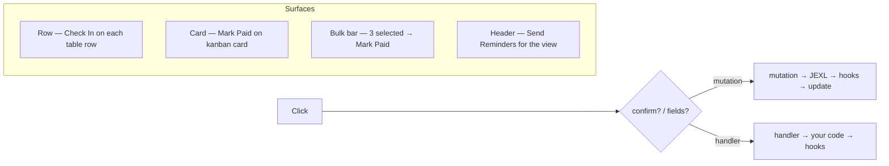

Views answer "what do I see." Actions answer "what can I do without opening the form." A `defineAction` is a single verb — `Check In`, `Mark Paid`, `Assign Table`, `Send Reminders` — that can surface as a row button, a card button, a bulk-bar button, or a view-header button.

By the end you'll know the 8 keys on `ActionConfig`, how `mutation` vs `handler` decides Cloud-safe vs self-hosted, and how to wire `type`, `confirm`, and `fields` so the button lands in the right place.

## Visual outcome



All mutations run through the collection's `beforeChange` and `afterChange` hook pipeline, ensuring access checks and validation are never bypassed.

## Action examples

### 1. Cloud-safe row action (declarative mutation)

Define a row action using a JSON mutation object:

```ts
import { defineAction } from "@dyrected/core";

export const checkInAction = defineAction({
  name: "checkIn",
  label: "Check In",
  icon: "UserCheck",
  type: "row",
  confirm: "Confirm guest check-in at the door?",
  mutation: { checkedIn: true, checkedInAt: "now()" },
});
```

The `"now()"` expression is evaluated on the server to an ISO timestamp. Declarative mutations are serializable, making them fully compatible with Dyrected Cloud and syncable across environments.

### 2. Row action with an input dialog

If an action requires user input (like selecting a seat or entering notes), declare `fields` to automatically generate an input modal:

```ts
import { defineAction, defineNumberField, defineTextField } from "@dyrected/core";

export const assignTableAction = defineAction({
  name: "assignTable",
  label: "Assign Table",
  icon: "Table2",
  type: "row",
  fields: [
    defineNumberField({ name: "tableNumber", label: "Table Number", required: true }),
    defineTextField({ name: "notes", label: "Seating Notes" }),
  ],
  mutation: { tableNumber: "input.tableNumber", seatingNotes: "input.notes" },
});
```

Expressions like `"input.tableNumber"` extract values submitted through the dialog.

### 3. Bulk and header actions

Define actions that operate across multiple selected documents or view-wide:

```ts
import { defineAction } from "@dyrected/core";

export const markSelectedPaidAction = defineAction({
  name: "markSelectedPaid",
  label: "Mark Paid",
  type: "bulk",
  mutation: { asoebiStatus: "paid", asoebiPaidAt: "now()" },
});

export const sendReminderAction = defineAction({
  name: "sendReminder",
  label: "Send Reminders",
  icon: "BellRing",
  type: "header",
  confirm: "Send a payment reminder to all guests with pending requests?",
  mutation: { remindedAt: "now()" },
});
```

## Configuration options

| Option | Type | Description |
| --- | --- | --- |
| `name` | `string` **required** | Unique identifier used for ordering, logging, and SDK triggers. |
| `label` | `string` **required** | Button text displayed to editors. |
| `icon` | `string` | Lucide icon name (e.g. `"UserCheck"`, `"Table2"`). |
| `type` | `"row"` \| `"bulk"` \| `"header"` | Where the button appears. Defaults to `"row"`. |
| `confirm` | `string` | Prompt text that triggers a confirmation modal before execution. |
| `fields` | `Field[]` | Input fields rendered in a modal before the action runs. Reuses Dyrected's central field rendering engine. |
| `mutation` | `Record<string, unknown>` | Declarative mutation object with expressions (`"now()"`, `"input.fieldName"`, `"doc.fieldName"`). |
| `handler` | `(ctx) => Promise<...>` | **Self-hosted only**: Custom async TypeScript handler for integrating third-party APIs (Stripe, Slack). |
| `access` | `AccessConfig` | Permissions controlling who can see or run the action. |

## Button placement and ordering

- **Row actions (`type: "row"`)**: Surface on table rows, kanban cards, calendar detail sheets, and gallery card tiles.
- **Bulk actions (`type: "bulk"`)**: Appear automatically in the floating bulk action bar when one or more items are selected.
- **Header actions (`type: "header"`)**: Positioned at the top of the view alongside search and filter controls.

To customize the order and visibility of built-in vs custom buttons on a view:
```ts
defineView({
  slug: "attending-guests",
  label: "Attending Guests",
  actions: [checkInAction],
  features: { delete: false }, // Hides the built-in delete button
  actionOrder: ["checkIn", "view", "edit"], // Places custom Check In first
});
```

## Cloud vs Self-hosted runtime

- **Dyrected Cloud**: Use declarative `mutation` objects (`mutation: { checkedIn: true, checkedInAt: "now()" }`). They sync cleanly via `sync:schema` and run in managed infrastructure.
- **Self-hosted**: You can use `handler` functions to execute arbitrary server code (e.g. charging a card with Stripe or sending a Slack alert) inside your application backend.

## Next steps

- Run actions programmatically from code — [Run an action (SDK)](/docs/deliver-content/sdk-api/run-action)
- Secure actions with role permissions — [Access Control](/docs/model-content/content-rules/access-control/overview)
- Configure view layouts — [Define a view](/docs/model-content/operational-views/define-view)
