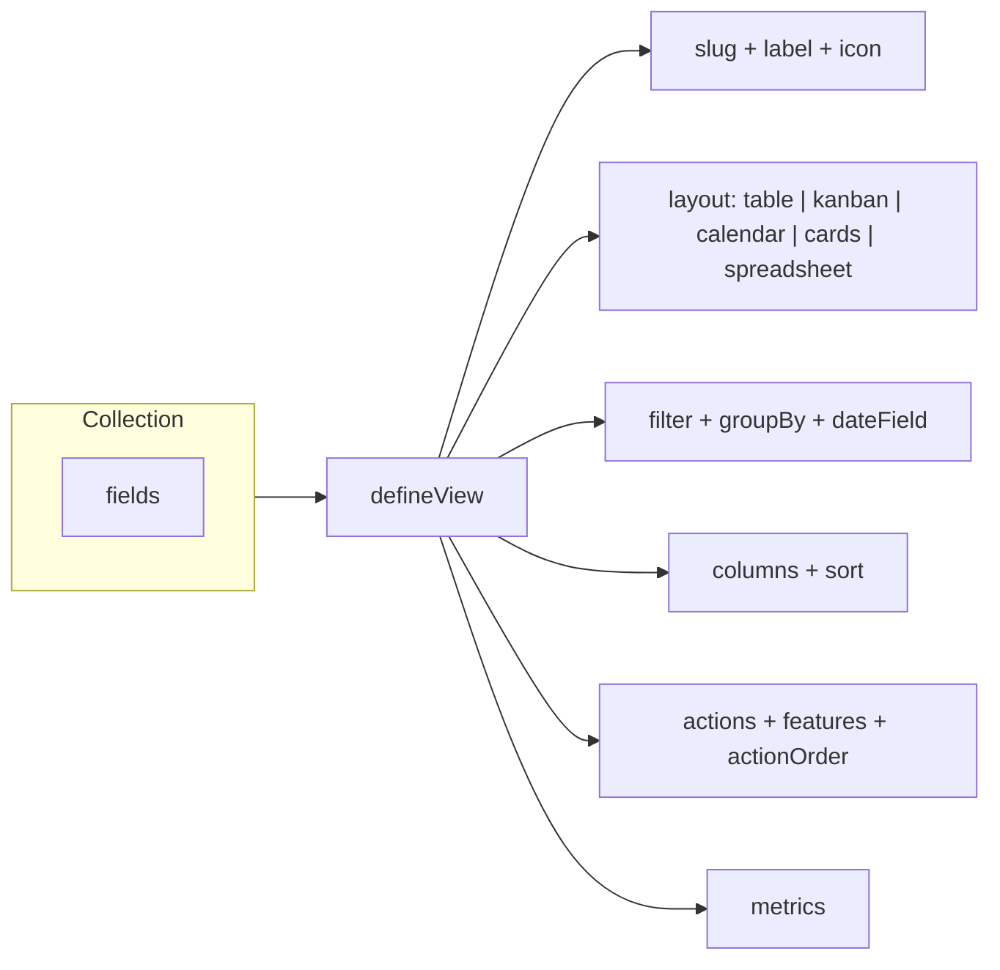

A view is a typed object that says: for this collection, show this subset of documents, in this shape, with these columns and these verbs. `defineView` is a helper that returns the same object — it exists for types and discoverability, not magic.

By the end you'll know every top-level option on `ViewConfig`, what each one does, and what a minimal table vs. kanban definition looks like.

## The mental model



One `views` entry becomes one sidebar item, one route (`/collections/:slug/views/:viewSlug`), and one persisted preference key. Dyrected does not copy data — every view reads the same collection.

## Minimal table view

To configure a table view, specify a `slug`, `label`, and the `columns` you want visible:

```ts
import { defineView } from "@dyrected/core";

export const attendingGuests = defineView({
  slug: "attending-guests",
  label: "Attending Guests",
  icon: "UserCheck",
  layout: "table",
  filter: { attending: { equals: true } },
  columns: ["name", "guestCount", "checkedIn"],
});
```

Dyrected synthesizes a table with search, sorting, and faceted filters. Layout defaults to `table` if you omit it.

### Compound filters with `OR` and `AND`

To create specialized views matching multiple conditions or alternative criteria, use compound `OR` or `AND` clauses in your `filter`:

```ts
import { defineView } from "@dyrected/core";

export const pendingLogistics = defineView({
  slug: "pending-logistics",
  label: "Pending Logistics",
  icon: "Package",
  layout: "table",
  filter: {
    OR: [
      { asoebiPaymentStatus: { equals: "pending" } },
      { asoebiOrderStatus: { equals: "unfulfilled" } },
    ],
  },
  columns: ["name", "asoebiPaymentStatus", "asoebiOrderStatus", "asoebiAmountPaid"],
});
```

Logical operators are case-insensitive (`OR` / `or`, `AND` / `and`) and can be combined with field-level filters.

## Kanban board view

Kanban views require a `groupBy` field to determine which field values represent the board's columns:

```ts
import { defineView, defineAction } from "@dyrected/core";

const markPaidAction = defineAction({
  name: "markPaid",
  label: "Mark Paid",
  type: "row",
  mutation: { asoebiStatus: "paid" },
});

export const asoebiPipeline = defineView({
  slug: "asoebi-pipeline",
  label: "Asoebi Fulfillment",
  icon: "Shirt",
  layout: "kanban",
  filter: { asoebi: { equals: true } },
  groupBy: "asoebiStatus",
  columns: ["name", "asoebiSize", "asoebiQuantity"],
  actions: [markPaidAction],
});
```

## Calendar schedule view

Calendar views require a `dateField` containing an ISO date string to position documents onto the calendar grid:

```ts
import { defineView } from "@dyrected/core";

export const tastingSchedule = defineView({
  slug: "tasting-schedule",
  label: "Tasting Schedule",
  icon: "Calendar",
  layout: "calendar",
  dateField: "appointmentDate",
  columns: ["name", "guestCount"],
});
```

## Adding view-specific component slots

If you want a custom widget, header banner, or toolbar extension on a **specific view** rather than across the whole collection, declare `components` directly inside `defineView`:

```ts
import { defineView } from "@dyrected/core";

export const asoebiPipeline = defineView({
  slug: "asoebi-pipeline",
  label: "Asoebi Fulfillment",
  icon: "Shirt",
  layout: "kanban",
  groupBy: "asoebiStatus",
  components: {
    beforeViewHeader: ["fulfillment-legend"],
    afterViewHeader: ["pipeline-kpi-summary"],
    beforeViewContent: ["kanban-filter-banner"],
    afterViewContent: ["fulfillment-footer-stats"],
  },
});
```

When both collection-wide slots (`collection.admin.components`) and view-specific slots (`view.components`) are defined, Dyrected cleanly merges them in hierarchical order: collection banners render first, followed by view-specific extensions.

## Setting a default view

To make a view the default landing page for a collection, set `defaultView` on the collection config pointing to the view's `slug`:

```ts
import { defineCollection, defineView } from "@dyrected/core";

export const attendingGuests = defineView({
  slug: "attending-guests",
  label: "Attending Guests",
  icon: "UserCheck",
  layout: "table",
  filter: { attending: { equals: true } },
  columns: ["name", "guestCount", "checkedIn"],
});

export const GuestResponses = defineCollection({
  slug: "guest-responses",
  defaultView: "attending-guests",
  views: [attendingGuests],
  fields: [
    // ...
  ],
});
```

When `defaultView` is set:
- Navigating to `/collections/guest-responses` redirects automatically to `/collections/guest-responses/views/attending-guests`.
- The sidebar's primary collection link opens the default view directly.
- The sidebar submenu cleanly lists your defined operational views without displaying a generic `All [Collection]` item.

## Configuration options

All options are optional except `slug` and `label`:

| Option | Type | What it does | When to set it |
| --- | --- | --- | --- |
| `slug` | `string` **required** | Stable path segment for the view. Used in URLs, sidebar keys, and preference persistence. | Always |
| `label` | `string` **required** | Human-readable title shown in the sidebar and view header. | Always |
| `icon` | `string` | Lucide icon name (e.g. `"UserCheck"`, `"Shirt"`, `"Calendar"`). | When you want the sidebar item to scan faster |
| `layout` | `ViewLayout` | `"table"` (default), `"kanban"`, `"calendar"`, `"cards"`, `"spreadsheet"`, or `"gantt"`. | Set explicitly to clarify design intent |
| `filter` | `WhereClause \| string` | Base filter applied before toolbar filters. Type-safe Where object (`{ attending: { equals: true } }`) or JEXL string. | When this view is a specialized subset |
| `groupBy` | `string` | Field name whose distinct values organize records into columns (`kanban`) or collapsible sections (`table`, `cards`, `spreadsheet`). | Required for `"kanban"`, optional for section grouping |
| `dateField` | `string` | Field name holding the ISO date string for placement. | Required for `"calendar"` |
| `startDateField` / `endDateField` | `string` | Start and end dates for timeline bars. | Required for `"gantt"` |
| `columns` | `string[]` | Field names shown in this view, in order. Falls back to default columns if omitted. | To curate relevant fields per role |
| `sort` | `{ field: string; direction: "asc"\|"desc" }` | Initial default sort order. | When chronological or priority order matters |
| `actions` | `ActionConfig[]` | Custom verbs available in this view. See [Actions](/docs/model-content/operational-views/actions). | When editors should trigger workflows directly |
| `features` | `ViewActionFeatures` | Toggles for built-in buttons: `view`, `edit`, `duplicate`, `delete`, `exportSelected`. | To hide built-ins (e.g. `delete: false`) |
| `actionOrder` | `string[]` | Explicit button order mixing custom action names and built-in verbs. | When button order conveys workflow priority |
| `metrics` | `ViewMetric[]` | KPI summary cards displayed above the view. See [Metrics](/docs/model-content/operational-views/metrics). | For high-level aggregations and counts |
| `components` | `ViewComponentSlots` | Custom component slots rendered around this operational view (`beforeViewHeader`, `afterViewHeader`, `beforeViewContent`, `afterViewContent`). | When you need custom widgets scoped to this view only |
| `access` | `AccessConfig` | Role-based permissions controlling who can see or act on this view. | When a view is role-restricted |

## Defaults and fallbacks

- **Hidden fields**: Metadata fields like `createdAt`, `updatedAt`, `id`, and join fields are automatically excluded when Dyrected infers default columns.
- **Search**: Every view inherits the collection's `admin.searchableFields` (or `useAsTitle` fallback). Search runs on the backend for fast querying across large datasets.

## Next steps

- Layout details — [Table](/docs/model-content/operational-views/layouts/table), [Kanban](/docs/model-content/operational-views/layouts/kanban), [Calendar](/docs/model-content/operational-views/layouts/calendar), [Cards](/docs/model-content/operational-views/layouts/cards), [Spreadsheet](/docs/model-content/operational-views/layouts/spreadsheet)
- Add workflow buttons — [Actions](/docs/model-content/operational-views/actions)
- Add KPI summary cards — [Metrics](/docs/model-content/operational-views/metrics)
- Best practices & anti-patterns — [UX guidelines](/docs/model-content/operational-views/ux-guidelines)

{/* GENERATED:REFERENCE-OPERATIONAL-VIEWS:START */}
{/* GENERATED:REFERENCE-OPERATIONAL-VIEWS:END */}
