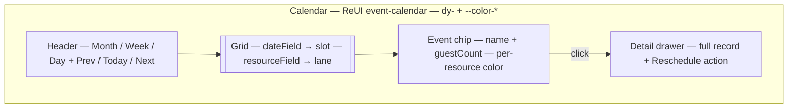

A calendar is a table where rows are days. When the job is "when is tasting, who is booked, what's unscheduled," nothing reads faster. A view with `dateField: "appointmentDate"` turns that ISO string into a placed event on month/week/day grids and, optionally, resource lanes.

By the end you'll know which field drives placement, how resources map to lanes, and what the drawer does when an editor clicks an event.

## Visual outcome




## When to use

- **Use when:** Records have a dedicated date/time field (`defineDateTimeField` or `defineDateField`) that drives the schedule (e.g. appointments, tasting schedules, event bookings, content releases).
- **Don't use when:** Records are undated, dates are optional/unstructured, or when the task is tracking a status pipeline (use `kanban`).

## Complete example

Configure a calendar schedule view mapped to an appointment date field:

```ts
import { defineView, defineAction, defineNumberField, defineTextField } from "@dyrected/core";

const assignTableAction = defineAction({
  name: "assignTable",
  label: "Assign Table",
  icon: "Table2",
  type: "row",
  fields: [
    defineNumberField({ name: "tableNumber", label: "Table Number", required: true }),
    defineTextField({ name: "notes", label: "Seating Notes" }),
  ],
  mutation: { tableNumber: "input.tableNumber", seatingNotes: "input.notes" },
});

export const tastingSchedule = defineView({
  slug: "tasting-schedule",
  label: "Tasting Schedule",
  icon: "Calendar",
  layout: "calendar",
  dateField: "appointmentDate",
  columns: ["name", "guestCount", "asoebiSize"],
  actions: [assignTableAction],
});
```

Setting `dateField: "appointmentDate"` positions each record onto the calendar grid. `columns` controls the fields displayed on event chips and inside the event detail inspection drawer. Clicking any event chip slides open the drawer where editors can view details and run row actions like `Assign Table`.


## Resource lanes (optional)

If your records are assigned to specific team members, rooms, or equipment, specify `resourceField` to break the calendar down into horizontal resource lanes:

```ts
import { defineView } from "@dyrected/core";

export const tastingScheduleByRoom = defineView({
  slug: "tasting-rooms",
  label: "Tasting by Room",
  icon: "Calendar",
  layout: "calendar",
  dateField: "appointmentDate",
  resourceField: "tastingRoom",
  columns: ["name", "guestCount"],
});
```

Dyrected automatically groups appointments into color-coded swim lanes by the distinct values in `tastingRoom`.

## UX guardrails

- **One date field per view**: If your collection tracks multiple dates (e.g. `appointmentDate` and `deliveryDate`), create two separate views rather than overloading one.
- **Concise chip text**: Keep event chips readable by placing the title and at most 1 secondary chip value on the calendar. Deeper details are shown in the drawer.
- **Drawer actions**: Row actions run from the event drawer and immediately refresh the calendar grid on completion.

## Next steps

- Define custom action mutations — [Actions](/docs/model-content/operational-views/actions)
- Add operational metrics — [Metrics](/docs/model-content/operational-views/metrics)
- Explore other layouts — [Table](/docs/model-content/operational-views/layouts/table), [Kanban](/docs/model-content/operational-views/layouts/kanban), [Cards](/docs/model-content/operational-views/layouts/cards), [Spreadsheet](/docs/model-content/operational-views/layouts/spreadsheet)
