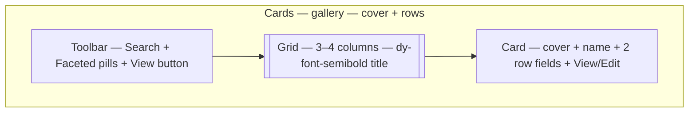

A gallery is a table with faces. When the record is understood faster from a cover, avatar, or thumbnail than from a row of text — profiles, listings, portfolios — a grid reads where a table scans.

By the end you should know when a gallery wins over a table, which fields become the cover and the rows, and how search and facets persist.

## Visual outcome




## When to use

- **Use when:** Records have visual assets (`image`, `avatar`, or media thumbnails) where visual scanning is faster than reading text rows (e.g. member directories, real estate listings, catalog portfolios).
- **Don't use when:** The task requires dense numeric editing (use `spreadsheet`), status pipelines (use `kanban`), or detailed audits/exports (use `table`).

## Complete example

Configure a visual card gallery with cover images, quick row actions, and summary metrics:

```ts
import { defineView, defineAction } from "@dyrected/core";

const checkInAction = defineAction({
  name: "checkIn",
  label: "Check In",
  icon: "UserCheck",
  type: "row",
  mutation: { checkedIn: true, checkedInAt: "now()" },
});

export const guestDirectory = defineView({
  slug: "guest-directory",
  label: "Guest Directory",
  icon: "LayoutGrid",
  layout: "cards",
  columns: ["name", "email", "attending", "asoebiSize", "tableNumber"],
  actions: [checkInAction],
  metrics: [
    { label: "All Responses", color: "blue", aggregate: { count: "*" } },
  ],
});
```

`columns` controls the card fields. If the collection includes an image, avatar, or media field, Dyrected displays it as the card's visual cover. `actions` places quick one-click buttons directly at the base of each card.

## Grouped card galleries

Add `groupBy` to organize visual cards into categorized sections (e.g. by department, category, or status):

```ts
import { defineView } from "@dyrected/core";

export const staffByDepartment = defineView({
  slug: "staff-by-department",
  label: "Staff by Department",
  icon: "LayoutGrid",
  layout: "cards",
  groupBy: "department",
  columns: ["name", "role", "email", "avatar"],
});
```

## Chrome features

- **Live Backend Search**: Search queries text and email fields across large datasets instantaneously.
- **Unified Filter Menu**: Filter by badges, select fields, numbers, or dates with active filter count badges.
- **Field & Label Toggles**: Editors can toggle column visibility and label density via the **Fields** menu.

## UX guardrails

- **Best with images**: Cards shine when records have visual media. If your collection contains only plain text, a `table` layout provides higher information density.
- **2–3 rows per card**: Keep card content brief (e.g. name, role, tag). Deep multi-line text belongs on the record's detail page.
- **Quick row actions**: Limit card buttons to 1–2 high-frequency actions (`View` or `Check In`).

## Next steps

- Add workflow buttons — [Actions](/docs/model-content/operational-views/actions)
- Add KPI summary cards — [Metrics](/docs/model-content/operational-views/metrics)
- Explore other layouts — [Table](/docs/model-content/operational-views/layouts/table), [Kanban](/docs/model-content/operational-views/layouts/kanban), [Calendar](/docs/model-content/operational-views/layouts/calendar), [Spreadsheet](/docs/model-content/operational-views/layouts/spreadsheet)
