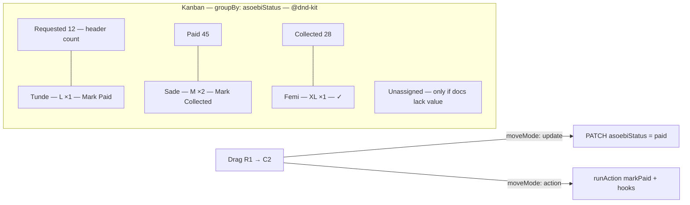

A kanban board is a table tipped on its side. Each column is a distinct value of one field (`groupBy`), each card is a document, and dragging a card writes that field. When the job is "move outfits from requested → paid → collected," a board reads instantly where a filtered table doesn't.

By the end you should know when a board is the right tool, which keys to set, and what the admin will render for `moveMode: "update"` vs `moveMode: "action"`.

## Visual outcome



## When to use

- **Use when:** You are modeling a clear status pipeline with 3–5 distinct phases (e.g. `requested` → `paid` → `collected`, or `applied` → `interviewing` → `offered`).
- **Don't use when:** The grouping field has more than 6 distinct values, is a free-text field, or when editors are doing bulk data exports rather than moving items between stages.

## Complete example

Configure a Kanban pipeline with dedicated card action buttons and drag-and-drop grouping:

```ts
import { defineView, defineAction } from "@dyrected/core";

const markPaidAction = defineAction({
  name: "markPaid",
  label: "Mark Paid",
  icon: "CreditCard",
  type: "row",
  mutation: { asoebiStatus: "paid", asoebiPaidAt: "now()" },
});

const markCollectedAction = defineAction({
  name: "markCollected",
  label: "Mark Collected",
  icon: "PackageCheck",
  type: "row",
  mutation: { asoebiStatus: "collected", asoebiCollectedAt: "now()" },
});

export const asoebiPipeline = defineView({
  slug: "asoebi-pipeline",
  label: "Asoebi Fulfillment",
  icon: "Shirt",
  layout: "kanban",
  filter: { asoebi: { equals: true } },
  groupBy: "asoebiStatus",
  columns: ["name", "asoebiSize", "asoebiQuantity"],
  actions: [markPaidAction, markCollectedAction],
});
```

Setting `groupBy: "asoebiStatus"` creates board columns corresponding to the options on the field. `columns` specifies the fields displayed as metadata chips on each card, and `actions` surfaces direct execution buttons right on each card.

## Drag-and-drop persistence

You can control how dragging a card to a new column updates the underlying document:

| Mode | What happens on drop | Example Configuration | When to use |
| --- | --- | --- | --- |
| `moveMode: "update"` | Directly updates the `groupBy` field to the target column value. | `defineView({ groupBy: "status", moveMode: "update" })` | Simple status progressions without additional side effects. |
| `moveMode: "action"` | Triggers a `defineAction` mutation, running custom expressions, timestamps, and validation hooks. | `defineView({ groupBy: "status", moveMode: "action", moveAction: "markPaid" })` | Multi-field mutations (e.g. setting `paidAt: "now()"`), confirmations, or custom backend handlers. |

All card moves run through access control and trigger optimistic UI updates with live feedback.

## UX guardrails

- **Columns 3–5**: Focus on the active operational pipeline. Hide archival or dead-end states in a filtered table view.
- **Card metadata**: Display the primary title prominently, followed by 1–2 key metadata badges (`size`, `quantity`).
- **Unassigned bucket**: If any documents lack a value for the `groupBy` field, Dyrected displays an **Unassigned** column so no records are lost.

## Next steps

- Define custom action mutations — [Actions](/docs/model-content/operational-views/actions)
- Add pipeline metrics — [Metrics](/docs/model-content/operational-views/metrics)
- Best practices & anti-patterns — [UX guidelines](/docs/model-content/operational-views/ux-guidelines)
- Explore other layouts — [Table](/docs/model-content/operational-views/layouts/table), [Calendar](/docs/model-content/operational-views/layouts/calendar), [Cards](/docs/model-content/operational-views/layouts/cards), [Spreadsheet](/docs/model-content/operational-views/layouts/spreadsheet)
