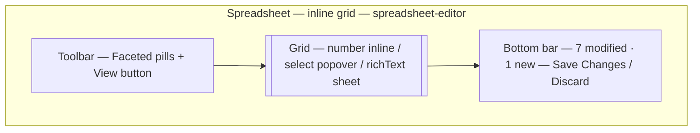

A spreadsheet is a form that looks like a grid. When the job is "fix 12 prices, flip three featured flags, fill missing sizes," opening 12 forms is the failure. A view with `layout: "spreadsheet"` turns the filtered subset into an editable matrix with type-aware editors and a batch save.

By the end you should know which fields edit inline vs in a popover, how batch save works, and why `blocks` and `richText` stay out of the grid.

## Visual outcome




## When to use

- **Use when:** You need to rapidly edit simple fields (prices, stock quantities, status flags, dates) across 10+ rows without clicking into individual edit forms.
- **Don't use when:** Records require heavy nested block editing (`blocks`), or when editors are working on a single record.

## Complete example

Configure a spreadsheet matrix view for fast inline editing:

```ts
import { defineView } from "@dyrected/core";

export const tableSeatingGrid = defineView({
  slug: "table-seating-grid",
  label: "Seating & Outfit Matrix",
  icon: "TableProperties",
  layout: "spreadsheet",
  filter: { attending: { equals: true } },
  columns: ["name", "tableNumber", "asoebiSize", "asoebiQuantity", "wellWishes"],
});
```

Setting `layout: "spreadsheet"` renders the data in a full keyboard-accessible spreadsheet grid.

## How fields edit in the grid

| Field Type | Cell Editor Interaction | Commit Timing |
| --- | --- | --- |
| `text`, `email`, `url` | Direct inline text editing | On cell blur / Enter |
| `number` | Direct inline numeric input | On cell blur / Enter |
| `boolean` | Interactive checkbox toggle | Immediate toggle |
| `date` / `datetime` / `time` | Inline calendar / time flyout | On date selection |
| `select`, `radio` | Searchable dropdown popover | On option select |
| `multiSelect` | Multi-tag dropdown popover | On item check |
| `relationship`, `image` | Standard media/document picker | On asset select |
| `textarea`, `json` | Anchored popover editor | On blur (`Esc` discards) |
| `richText` | Slide-over full rich-text editor | On drawer close |
| `blocks` | Complex blocks are edited in the form | Open the record form |

## Batch saving & safety

Changes made in the grid are staged locally in the browser so you can modify multiple rows before committing:

- **Save Changes**: Submits all modified cells and newly created rows in a single batch, running validation and backend hooks.
- **Discard**: Resets all unsaved cell edits back to the current server state.

## Keyboard navigation

The grid supports full spreadsheet navigation shortcuts:
- **`Tab` / `Shift + Tab`**: Navigate to next/previous cell across columns.
- **`Enter` / `Down Arrow`**: Commit cell and move to the row below.
- **`Esc`**: Cancel cell editing.
- **`Ctrl/Cmd + C` / `Ctrl/Cmd + V`**: Copy and paste cell values.

## Next steps

- Explore all layout options — [UX guidelines](/docs/model-content/operational-views/ux-guidelines)
- Configure summary cards — [Metrics](/docs/model-content/operational-views/metrics)
- Learn other layouts — [Table](/docs/model-content/operational-views/layouts/table), [Kanban](/docs/model-content/operational-views/layouts/kanban), [Calendar](/docs/model-content/operational-views/layouts/calendar), [Cards](/docs/model-content/operational-views/layouts/cards)
