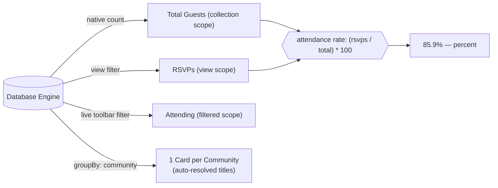

A metric is a KPI card that sits above your operational view. Instead of loading thousands of records into browser memory to calculate revenue or counts, the view runs native database aggregate queries (`count`, `sum`, `avg`, `min`, `max`, `distinctCount`) directly on the backend engine. You can also combine results with JEXL math expressions, break them down dynamically with `groupBy`, or scope them to react live to user filters.

By the end of this guide, you will know how to configure database aggregates, control filter scoping, dynamically group cards across relationships or categories, and customize metrics in code or directly from the Admin UI.

## Visual outcome



Because aggregations run directly on your database engine, cards compute summary stats across tens of thousands of documents in milliseconds without table scans or client-side bottlenecks.

## Metric scoping

By default, a metric card evaluates against the view's base filter. However, different operational questions require different boundaries: you might want a global benchmark that never changes, or a reactive counter that updates as someone types in the search bar.

Dyrected provides three distinct scopes:

| Scope | Behavior | When to use |
| --- | --- | --- |
| `'view'` *(default)* | Evaluates against the view's predefined `filter`. Ignores temporary user searches or column filters. | Stable operational baselines (e.g. total records assigned to this pipeline stage). |
| `'filtered'` | Re-aggregates live whenever an operator searches, sorts, or filters rows in the table toolbar. | Interactive drill-downs (e.g. seeing total order value update as you filter by region). |
| `'collection'` | Evaluates across the entire collection, ignoring both the view filter and table toolbar filters. | Global reference benchmarks (e.g. comparing this view's count against all records in the company). |

### Setting a view-wide default scope

If you want all metric cards in an operational view to react live to table searches and column filters, set `metricsScope: "filtered"` on the view definition:

```ts
import { defineView } from "@dyrected/core";

export const eventGuestsView = defineView({
  slug: "attending-guests",
  label: "Attending Guests",
  layout: "table",
  filter: { attending: { equals: true } },
  columns: ["name", "tableNumber", "guestCount"],
  // All metric cards in this view update live when searching or filtering
  metricsScope: "filtered",
  metrics: [
    {
      label: "Matching Guests",
      color: "emerald",
      aggregate: { count: "*" },
    },
  ],
});
```

When an operator filters the table by table number or searches for a name, the "Matching Guests" card recalculates live against only the matching records.

### Overriding scope per card or sub-metric

You can also mix scopes within the same view. For example, you can display a global collection total right next to a filtered view count:

```ts
import { defineView } from "@dyrected/core";

export const guestCheckInView = defineView({
  slug: "door-checkin",
  label: "Door Check-in",
  layout: "table",
  filter: { attending: { equals: true } },
  columns: ["name", "checkedIn"],
  metrics: [
    {
      label: "Active Search Count",
      color: "emerald",
      // Re-aggregates live as operators type in search or filter columns
      scope: "filtered",
      aggregate: { count: "*" },
    },
    {
      label: "Total Invited",
      color: "blue",
      // Always counts the entire guests collection regardless of filters
      scope: "collection",
      aggregate: { count: "*" },
    },
  ],
});
```

Dyrected displays a subtle scope indicator icon in the top right corner of cards that override default scoping:
- **Filter icon**: Indicates `'filtered'` scope (live synchronization with toolbar filters).
- **Database icon**: Indicates `'collection'` scope (global database totals).
- **Layers icon**: Indicates `'view'` scope.

## Dynamic grouping with `groupBy`

Instead of hardcoding separate metric cards for every department, community, or status, you can provide `groupBy: "fieldName"`. Dyrected automatically queries distinct groups and generates dynamic items in a single, batched database aggregation query.

### Grouping cards (1 card per group)

Setting `groupBy` on a primary metric card expands that definition into multiple sibling cards:

```ts
import { defineView } from "@dyrected/core";

export const guestsByCommunity = defineView({
  slug: "community-breakdown",
  label: "Community Breakdown",
  layout: "table",
  columns: ["name", "community", "tableNumber"],
  metrics: [
    {
      // {{group.label}} renders the resolved name (e.g. "Ikoyi", "Victoria Island")
      label: "{{group.label}} Guests",
      color: "purple",
      unit: "Guests",
      groupBy: "community",
      aggregate: { count: "*" },
    },
  ],
});
```

If your collection contains records belonging to three communities, Dyrected automatically renders three cards side-by-side: "Ikoyi Guests", "Victoria Island Guests", and "Lekki Guests".

### Grouping sub-metrics (breakdown rows inside a card)

If you prefer a single card with compact breakdown rows in its footer, place `groupBy` on a sub-metric instead:

```ts
import { defineView } from "@dyrected/core";

export const rsvpSummaryView = defineView({
  slug: "rsvp-summary",
  label: "RSVP Summary",
  layout: "table",
  columns: ["name", "status", "partySize"],
  metrics: [
    {
      label: "Total Registrations",
      color: "indigo",
      aggregate: { count: "*" },
      subMetrics: [
        {
          // Expands into multiple rows inside the footer (e.g. "Confirmed", "Declined", "Waitlist")
          label: "{{group.label}}",
          groupBy: "status",
          aggregate: { count: "*" },
        },
      ],
    },
  ],
});
```

### Supported field types and label resolution

The `groupBy` option supports multiple field types:

1. **Relationship fields**: Dyrected inspects the related collection and automatically resolves document IDs to human-readable titles using the related collection's `admin.useAsTitle` setting (or fallback fields like `title`, `name`, or `label`).
2. **Select and radio fields**: Dyrected looks up the option definition and displays the human-friendly option label instead of raw internal values.
3. **Boolean fields**: Formatted cleanly as `true` / `false` or customizable labels.
4. **Scalar fields**: Text, numbers, or category codes.

### Template tokens

In your `label` string, use double curly braces to interpolate group data:

- `{{group.label}}`: The human-readable label (e.g., the related document title, the select option label, or formatted boolean).
- `{{group.value}}`: The raw stored database value or document ID.

### Advanced group configuration

When you need to control limits, ordering, or filter which groups appear, pass a configuration object instead of a field string:

```ts
{
  label: "{{group.label}} Top Sellers",
  color: "emerald",
  groupBy: {
    field: "category",
    limit: 5,            // Show only top 5 groups
    orderBy: "count",    // Order groups descending by aggregate count
    where: { active: { equals: true } }, // Filter eligible groups
  },
  aggregate: { count: "*" },
}
```

## Configuration patterns

### 1. Simple count metric

Count matching documents directly in the database:

```ts
import { defineView } from "@dyrected/core";

export const attendingGuests = defineView({
  slug: "attending-guests",
  label: "Attending Guests",
  layout: "table",
  filter: { attending: { equals: true } },
  columns: ["name", "guestCount"],
  metrics: [
    {
      label: "Total Attending",
      color: "emerald",
      aggregate: { count: "*", where: { attending: { equals: true } } },
    },
  ],
});
```

### 2. Distinct count of unique values

Count unique non-null values for a field (e.g. how many distinct tables have seated guests):

```ts
export const occupiedTables = {
  label: "Occupied Tables",
  color: "indigo",
  unit: "Tables",
  aggregate: {
    distinctCount: "tableNumber",
    where: { attending: { equals: true } },
  },
};
```

### 3. Calculated revenue with `transform`

Multiply an aggregated numeric sum by a unit price:

```ts
export const revenueMetric = {
  label: "Estimated Revenue",
  color: "rose",
  aggregate: {
    sum: "asoebiQuantity",
    cast: "number",
    where: { asoebiStatus: { in: ["paid", "collected"] } },
  },
  transform: "value * 25000",
  format: "currency",
  currency: "NGN", // Displays as: ₦2,125,000
};
```

In `transform`, `value` represents the numeric result returned by the database operation.

### 4. Multi-aggregate expressions & ratios

Combine multiple database operations using an `expression`:

```ts
export const attendanceRate = {
  label: "Attendance Rate",
  color: "amber",
  aggregates: {
    totalInvited:   { count: "*" },
    totalAttending: { count: "*", where: { attending: { equals: true } } },
  },
  expression: "math.round((aggregates.totalAttending / aggregates.totalInvited) * 100, 1)",
  format: "percent", // Displays as: 85.9%
};
```

### 5. Multi-submetric card

Show a primary headline count alongside static secondary breakdown items:

```ts
export const checkInMetric = {
  label: "Door Check-In",
  color: "emerald",
  unit: "Guests",
  aggregates: {
    checkedIn: { count: "*", where: { checkedIn: { equals: true } } },
    attending: { count: "*", where: { attending: { equals: true } } },
  },
  expression: "aggregates.checkedIn",
  subMetrics: [
    {
      label: "Pending",
      aggregates: {
        checkedIn: { count: "*", where: { checkedIn: { equals: true } } },
        attending: { count: "*", where: { attending: { equals: true } } },
      },
      expression: "aggregates.attending - aggregates.checkedIn",
    },
  ],
};
```

## Customizing metrics in the Admin UI

Operators and administrators can customize metrics directly in the Dyrected Admin UI without editing code.

1. Open any collection and click the **Customize** or gear icon in the navigation header.
2. In the Navigation Customizer, click the view you wish to edit and expand **Metrics (KPI Cards)**.
3. Click any metric chip in the **ViewMetricsBuilder** to select it.
4. From the edit drawer:
   - Toggle the **Scope** (`"View Filtered"`, `"Live Table Filter"`, or `"Entire Collection"`).
   - Choose a **Group By** field to turn the card into dynamic groups.
   - Adjust the card color palette or label.
5. If you want to reset any customized view back to the developer's original configuration in code, click the **Revert View** button.

## Options reference

### `ViewConfigBase` options

| Property | Type | Default | Description |
| --- | --- | --- | --- |
| `metricsScope` | `'view' \| 'filtered' \| 'collection'` | `'view'` | Default filter scoping for all metric cards in this operational view. |
| `metrics` | `ViewMetric[]` | `[]` | Array of KPI metric cards rendered above the view content. |

### `ViewMetric` options

| Property | Type | Description |
| --- | --- | --- |
| `label` | `string` **required** | Title displayed on the metric card. Supports `{{group.label}}` and `{{group.value}}` when `groupBy` is set. |
| `color` | `MetricColor` | Theme palette accent (`"purple"`, `"emerald"`, `"amber"`, `"rose"`, `"blue"`, `"indigo"`, `"cyan"`, `"orange"`). |
| `unit` | `string` | Optional unit badge displayed alongside the hero value (e.g. `"Guests"`, `"Orders"`, `"Tables"`). |
| `scope` | `'view' \| 'filtered' \| 'collection'` | Scoping override for this card. Defaults to the view's `metricsScope` (or `'view'`). |
| `groupBy` | `string \| ViewMetricGroupByConfig` | Dynamic breakdown: generates 1 card per distinct group value or related document. |
| `aggregate` | `AggregateOperation` | Single operation `{ count: "*", distinctCount: "field", sum: "field", avg: "field", min: "field", max: "field", where?, cast?: "number" }`. |
| `aggregates` | `Record<string, AggregateOperation>` | Named map of operations referenced in `expression` as `aggregates.key`. |
| `transform` | `string` | JEXL formula evaluated over `value` for single aggregates (e.g. `"value * 100"`). |
| `expression` | `string` | JEXL formula evaluated over `aggregates` (e.g. `"aggregates.a + aggregates.b"`). |
| `format` | `"currency"` \| `"number"` \| `"percent"` | Formatter applied to the final number. |
| `currency` | `string` | 3-letter currency code (e.g. `"USD"`, `"NGN"`, `"EUR"`) used when `format: "currency"`. |
| `subMetrics` | `ViewSubMetric[]` | Array of sub-metrics displayed in a compact breakdown footer under the main card. |

### `ViewSubMetric` options

| Property | Type | Description |
| --- | --- | --- |
| `label` | `string` **required** | Label for the breakdown row. Supports `{{group.label}}` and `{{group.value}}`. |
| `scope` | `'view' \| 'filtered' \| 'collection'` | Scoping override for this sub-metric row. Defaults to the parent card's scope. |
| `groupBy` | `string \| ViewMetricGroupByConfig` | Groups this sub-metric by field or relationship, expanding into multiple footer rows. |
| `aggregate` | `AggregateOperation` | Single database aggregate operation. |
| `aggregates` | `Record<string, AggregateOperation>` | Named map of operations referenced in `expression`. |
| `transform` | `string` | JEXL formula evaluated over `value`. |
| `expression` | `string` | JEXL formula evaluated over `aggregates`. |
| `format` | `"currency"` \| `"number"` \| `"percent"` | Formatter applied to the number. |
| `currency` | `string` | 3-letter currency code when `format: "currency"`. |

## UX guardrails

- **2–4 cards per view**: Keep the metric row focused on primary operational indicators. When using `groupBy` on cards, set a sensible `limit` (e.g. 4–6) to prevent excessive cards from crowding the screen.
- **Percentages are 0–100**: Formulas formatted with `format: "percent"` should output values in the range `0–100`.
- **Adaptive mobile layout**: Cards with `subMetrics` automatically expand full-width on mobile viewports for clean horizontal readability.

## Next steps

- Add workflow buttons — [Actions](/docs/model-content/operational-views/actions)
- Configure view layouts — [Define a view](/docs/model-content/operational-views/define-view)
- Layout best practices — [UX guidelines](/docs/model-content/operational-views/ux-guidelines)

