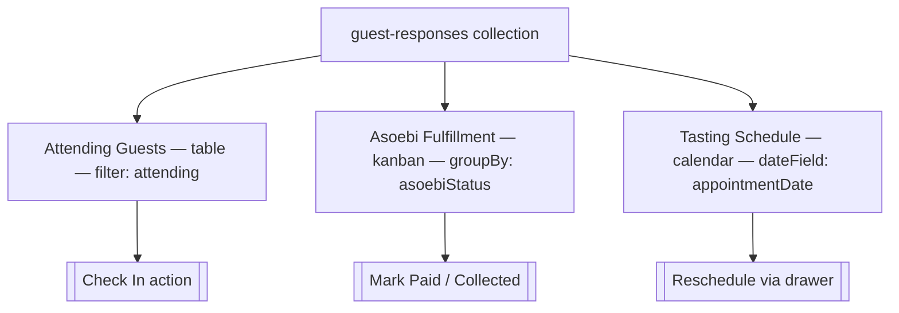
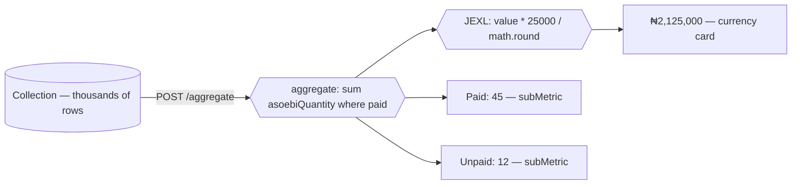

In real-world applications, a single collection often serves multiple team members with completely different workflows.

Imagine you are building an event and wedding portal. When guests fill out an RSVP form on your website, all their information is saved into a single `guest-responses` collection:
- Attendance, plus-ones, and table seating
- Ceremonial outfit orders (such as traditional *asoebi* attire), sizes, and payment status
- Tasting appointment bookings and personalized notes

On the day of the event, three different people need to work with these records simultaneously:

1. **The Receptionist at the door**: Needs an alphabetical list of confirmed attendees to verify names and click a one-click **Check In** button. They don't want to see garment sizes or tasting dates.
2. **The Wardrobe Coordinator**: Needs a visual Kanban board grouped by fulfillment status (*Requested → Paid → Collected*) with revenue totals to hand out packages.
3. **The Event Planner**: Needs a monthly and weekly calendar to track tasting sessions and manage bookings.

### The modeling dilemma

- **Option A (One giant table)**: Everyone uses the default 15-column table. Staff members spend half their day scrolling horizontally, searching for the two fields they care about.
- **Option B (Separate collections)**: You create `guests`, `outfits`, and `appointments` collections. Now you have duplicate data, stale records, and complex cross-collection sync logic.

### The Dyrected solution: Operational Views

Operational views give you the best of both worlds: **one database collection as the single source of truth, rendered as multiple focused workspaces**. You configure each workspace in code with its own layout, filtered dataset, visible columns, custom actions, and real-time KPI metrics.




## What you get

When you add `views` to a collection, Dyrected generates:

- **Nested navigation** — views appear beneath the parent collection in the sidebar, with icons and counts. Collections without `views` still get a synthesized `list` table view so `/collections/:slug` never breaks.
- **Layout-specific workspaces** — `table` (faceted filters and row actions), `kanban` (drag-and-drop pipeline board), `calendar` (dated event schedule), `cards` (visual gallery grid), `spreadsheet` (high-density editable matrix). Each respects `columns`, `filter`, `sort`, and persists column/view choices per editor.
- **Actions where they belong** — row buttons, kanban cards, bulk bar, and view header via `defineAction`.
- **Metrics above the data** — KPI cards powered by the aggregation engine (`count`, `sum`, `avg` with JEXL `transform` / `expression`).



If a view updates a record, your collection's `beforeChange` and `afterChange` hooks still run.

## When to use a view

Reach for a view when the same collection has distinct audiences or workflows:

- different columns matter (door staff doesn't need asoebi size)
- different subsets matter (only `attending: true`, only `asoebi: true`)
- different verbs matter (check in vs. mark paid vs. reschedule)
- different shapes matter (board for status, calendar for dates, gallery for media)

Stay with the default table when every editor needs the same columns and the same actions. You can always add views later — a collection without `views` synthesizes a `list` table from `admin.defaultColumns` or the first five display fields.

## Minimal example

The snippet below is the canonical Guest Responses fixture from `apps/example-creator-next/dyrected.config.ts`. It defines three views on one collection and reuses the same actions in the table and the board.

```ts
import {
  defineCollection,
  defineTextField,
  defineBooleanField,
  defineNumberField,
  defineSelectField,
  defineDateTimeField,
  defineTextareaField,
  defineView,
  defineAction,
} from "@dyrected/core";

const checkInAction = defineAction({
  name: "checkIn",
  label: "Check In",
  icon: "UserCheck",
  type: "row",
  confirm: "Confirm guest check-in at the door?",
  mutation: { checkedIn: true, checkedInAt: "now()" },
});

const markPaidAction = defineAction({
  name: "markPaid",
  label: "Mark Paid",
  icon: "CreditCard",
  type: "row",
  mutation: { asoebiStatus: "paid", asoebiPaidAt: "now()" },
});

const markCollectedAction = defineAction({
  name: "markCollected",
  label: "Mark Collected",
  icon: "PackageCheck",
  type: "row",
  mutation: { asoebiStatus: "collected", asoebiCollectedAt: "now()" },
});

export const GuestResponses = defineCollection({
  slug: "guest-responses",
  labels: { singular: "Guest Response", plural: "Guest Responses" },
  admin: { useAsTitle: "name", icon: "Users", defaultColumns: ["name", "guestCount", "asoebiStatus"] },
  fields: [
    defineTextField({ name: "name", label: "Full Name", required: true }),
    defineTextField({ name: "email", label: "Email" }),
    defineBooleanField({ name: "attending", label: "Attending" }),
    defineNumberField({ name: "guestCount", label: "Plus-Ones", defaultValue: 0 }),
    defineNumberField({ name: "tableNumber", label: "Table Number" }),
    defineBooleanField({ name: "checkedIn", label: "Checked In", defaultValue: false }),
    defineDateTimeField({ name: "checkedInAt", label: "Checked In At" }),
    defineBooleanField({ name: "asoebi", label: "Wants Asoebi" }),
    defineSelectField({ name: "asoebiStatus", label: "Asoebi Status", options: ["requested", "paid", "collected"], defaultValue: "requested" }),
    defineSelectField({ name: "asoebiSize", label: "Asoebi Size", options: ["S", "M", "L", "XL", "XXL"] }),
    defineNumberField({ name: "asoebiQuantity", label: "Quantity", defaultValue: 1 }),
    defineDateTimeField({ name: "appointmentDate", label: "Tasting Date" }),
    defineTextareaField({ name: "wellWishes", label: "Well Wishes" }),
  ],
  views: [
    defineView({
      slug: "attending-guests",
      label: "Attending Guests",
      icon: "UserCheck",
      layout: "table",
      filter: { attending: { equals: true } },
      columns: ["name", "guestCount", "tableNumber", "checkedIn"],
      actions: [checkInAction],
      metrics: [
        { label: "Total Attending", aggregate: { count: "*", where: { attending: { equals: true } } } },
        { label: "Checked In", aggregate: { count: "*", where: { checkedIn: { equals: true } } } },
      ],
    }),
    defineView({
      slug: "asoebi-pipeline",
      label: "Asoebi Fulfillment",
      icon: "Shirt",
      layout: "kanban",
      filter: { asoebi: { equals: true } },
      groupBy: "asoebiStatus",
      columns: ["name", "asoebiSize", "asoebiQuantity"],
      actions: [markPaidAction, markCollectedAction],
    }),
    defineView({
      slug: "tasting-schedule",
      label: "Tasting Schedule",
      icon: "Calendar",
      layout: "calendar",
      dateField: "appointmentDate",
      columns: ["name", "guestCount"],
    }),
  ],
});
```

What just happened: three `defineView` entries share one collection. The table filters to attending guests and exposes **Check In**, the board groups by `asoebiStatus` and exposes **Mark Paid** / **Mark Collected**, and the calendar maps `appointmentDate` onto month/week/day. Each view carries its own columns and metrics but writes to the same documents.

## Where to go next

- Configure the shape — [Define a view](/docs/model-content/operational-views/define-view)
- Choose a layout — [Table](/docs/model-content/operational-views/layouts/table), [Kanban](/docs/model-content/operational-views/layouts/kanban), [Calendar](/docs/model-content/operational-views/layouts/calendar), [Cards](/docs/model-content/operational-views/layouts/cards), [Spreadsheet](/docs/model-content/operational-views/layouts/spreadsheet)
- Add verbs — [Actions](/docs/model-content/operational-views/actions)
- Add numbers — [Metrics](/docs/model-content/operational-views/metrics)
- Behavior in the admin — [Routing and preferences](/docs/model-content/operational-views/routing-and-preferences)
- Polish the UX — [UX guidelines](/docs/model-content/operational-views/ux-guidelines)

{/* GENERATED:REFERENCE-OPERATIONAL-VIEWS:START */}
{/* GENERATED:REFERENCE-OPERATIONAL-VIEWS:END */}
