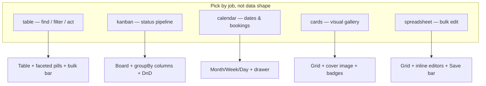

Every view should feel like it was designed for one person's one job. This page gives you the planning lens before you write `defineView` — which layout to pick, how many columns and actions to ship with, and what the admin will actually render. The layout pages that follow keep the deep details; this one is the shared 30%.

By the end you should be able to sketch any view on paper, decide its layout in under a minute, and know the 3–5 values that make or break the UX.

## Visual outcome first

Plan the shape before the config. Each `layout` maps to a different chrome — knowing the chrome tells you which `groupBy`, `dateField`, and `columns` you actually need.

Each layout provides a distinct workspace experience, letting team members focus on the fields, actions, and data density relevant to their specific role.

## Defaults to ship with

These are opinionated starting points. Start here, then refine as your team's workflow grows:

- **One collection → 2–3 views max.** Keep the navigation focused and fast to scan. If a collection seems to need five or more views, consider whether the data should be split into distinct collections.
- **Columns 3–5.** Start with the title field plus 2–4 status, owner, or date fields. Editors can always reveal or reorder additional fields using the **View** button in the toolbar.
- **Metrics 2–3 above the fold.** A total count, a conditional count, and one primary business metric (such as revenue or conversion rate) is ideal. See [Metrics](/docs/model-content/operational-views/metrics).
- **Actions 1–2 per row or bulk.** Hide built-in actions you don't want with `features: { delete: false, duplicate: false }` and order custom actions cleanly with `actionOrder: ["checkIn", "view", "edit"]`.

## Anti-patterns

- **Too many groups.** `groupBy` with more than 6 distinct values makes horizontal scrolling unwieldy. Split the view or narrow the `filter`.
- **Kanban without workflow.** If a field isn't representing a true step-by-step status progression, use `table` with a filter pill instead of a board.
- **Calendar without a date.** A calendar view without `dateField` or with non-standard dates has nowhere to place documents — use a `table` until you have an ISO date field.
- **Cards without a cover.** A gallery without an image or avatar field is just a spaced-out table. Use `cards` when visual thumbnails exist.
- **Spreadsheet for complex blocks/richText.** Nested JSON blocks and rich text don't collapse into a single grid cell. Use standard forms for deep nested documents.
- **Destructive drags without confirm.** Kanban moves configured with `moveMode: "action"` should require confirmation unless the status change is easily reversible. Prefer `moveMode: "update"` for simple status field updates.

## Checklist per layout

Use this checklist as a guide before finalizing your view configurations:

| Layout | When to use | Don't use when | Recommended Columns | Actions | Empty & Loading States | Accessibility |
| --- | --- | --- | --- | --- | --- | --- |
| `table` | Dense searching, filtering, audits, and exports. Default layout. | The team's primary task is visual card grouping or calendar scheduling. | `name`, `status`, `owner`, `date` (3–5). | Row `Check In`, header `Export`, bulk `Delete`. | Clear empty state with active filter pills and total counts. | Sticky headers, full keyboard navigation, ARIA roles. |
| `kanban` | Step-by-step status pipelines (e.g. `requested → paid → collected`). | Flat lists or non-workflow grouping (>6 values). | `name`, `size`, `qty` (2–3 under the card title). | Card actions (`Mark Paid`), board header `Export`. | Unassigned bucket when unassigned items exist; intuitive drop targets. | Visible focus rings, keyboard movement support. |
| `calendar` | Event booking, scheduling, appointments (`dateField` required). | Undated or unstructured date records. | `name`, `guestCount` in event chips; full details in side drawer. | Drawer actions (e.g. `Reschedule`). | Month/week/day navigation, clean "No events" indicator. | Full date navigation via keyboard, accessible modal traps. |
| `cards` | Visual galleries, team directories, media libraries. | Dense numeric or high-volume administrative data. | `avatar`, `name`, `tag`. | Quick `View` / preview actions. | Inline search and faceted category pills. | Descriptive alt tags on cover images, high contrast headers. |
| `spreadsheet` | Fast batch data entry (prices, inventory, toggles). | Long-form articles, rich text, or nested block structures. | 3–6 editable columns (numbers, strings, booleans, dates). | Floating batch `Save Changes` & `Discard` bar. | Inline row creation, unsaved changes exit warning. | Excel-style `Tab`, `Enter`, `Esc`, and arrow navigation. |

## Recommended path

1. **Sketch the view**: Title, 3 key columns, 1 action verb, and 1 metric card.
2. **Implement `table` first**: Provide a `filter`, 3 `columns`, and a `row` action. Verify the filter and sidebar appearance.
3. **Add specialized views**: Add `kanban` with `groupBy` or `calendar` with `dateField` for distinct team roles.
4. **Add metrics**: Add metric cards to give high-level visibility to administrators.
