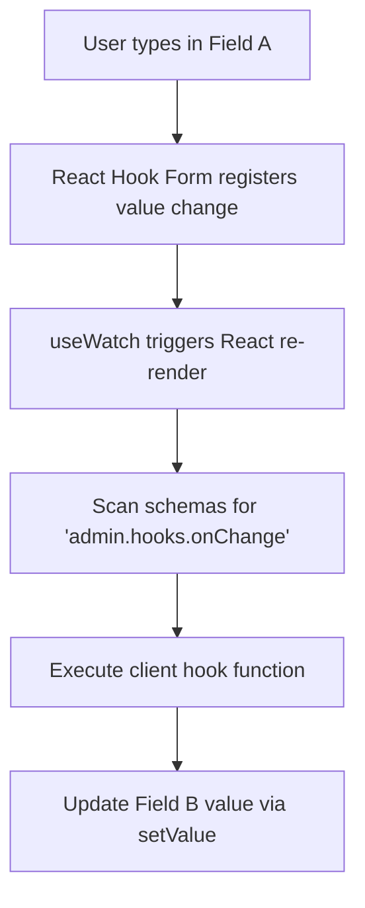
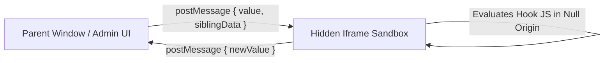

# Specification: Client-Side Reactivity & UI Hooks

This specification outlines the architecture, configuration API, and front-end integration guidelines to bring real-time client-side reactivity (similar to Retool or dynamic spreadsheets) to Dyrected forms.

---

## 1. Context & Motivation

Dyrected currently supports **server-side hooks** (`beforeChange`, `afterRead`) which run during database operations. While these are critical for database safety and backend integration, they do not run in the user's browser.

For a modern editor experience, users expect interactive reactivity—such as a `slug` field updating automatically as a user types a `title`, or a `totalPrice` calculating live based on `price` and `tax` inputs.

This spec details how we extend the **Client-Side Reactivity Engine** within the admin form renderer.

---

## 2. Schema API Design

Instead of creating new top-level schema blocks, client-side hooks are nested directly inside the existing field `admin` object. This maintains clean separation between database-centric definitions and user-interface behavior.

We support **Interactive UI Hooks** that compile and execute only in the browser context.

```typescript
export const Invoices = defineCollection({
  slug: 'invoices',
  fields: [
    { name: 'price', type: 'number' },
    { name: 'taxRate', type: 'number', defaultValue: 15 },
    {
      name: 'totalPrice',
      type: 'number',
      admin: {
        readOnly: true,
        // Client-side hooks nested inside the admin config object
        hooks: {
          onChange: ({ siblingData }) => {
            const price = siblingData.price || 0
            const taxRate = siblingData.taxRate || 0
            return price + (price * (taxRate / 100))
          }
        }
      }
    }
  ]
})
```

---

## 3. Form Engine Integration & Implementation

To implement client-side reactivity, we will update `FormEngine` and `FormFieldRenderer` to register field observers.

### The Lifecycle Pipeline



### Implementation Details:
1. **Dependency Analysis:** To prevent infinite update loops, the form engine inspects the values passed from `useWatch({ control })` to resolve dependencies.
2. **Update Scheduling:** When a dependency changes, the form engine triggers the computation and uses `setValue(fieldName, newValue, { shouldDirty: true })` to update the form state.
3. **Circular Reference Protection:** Guard the updates by comparing the calculated value with the current form value; if they are identical, do not trigger a new write.

---

## 4. Key Use Cases

### Test Case 1: Slug Auto-Generation
* **Trigger:** Typing in the `title` field.
* **Logic:** Convert spacing to hyphens, lowercase characters, and remove special symbols.
* **Schema Configuration:**
  ```typescript
  {
    name: 'slug',
    type: 'text',
    admin: {
      hooks: {
        onChange: ({ siblingData }) => {
          return (siblingData.title || '')
            .toLowerCase()
            .replace(/[^a-z0-9]+/g, '-')
            .replace(/(^-|-$)/g, '')
        }
      }
    }
  }
  ```

### Test Case 2: Dependent Dropdowns (Cascading Filters)
* **Trigger:** Selecting a value in the `country` select dropdown.
* **Logic:** Dynamically populate options in the `state` select dropdown.
* **Schema Configuration:**
  ```typescript
  {
    name: 'country',
    type: 'select',
    options: [{ label: 'Canada', value: 'ca' }, { label: 'United States', value: 'us' }]
  },
  {
    name: 'state',
    type: 'select',
    // Use admin.hooks.options — NOT admin.hooks.onChange.
    // onChange sets a field's VALUE; options sets a field's available CHOICES.
    admin: {
      hooks: {
        options: ({ siblingData }) => {
          if (siblingData.country === 'us') {
            return [{ label: 'California', value: 'CA' }, { label: 'New York', value: 'NY' }]
          }
          if (siblingData.country === 'ca') {
            return [{ label: 'Ontario', value: 'ON' }, { label: 'Quebec', value: 'QC' }]
          }
          return []
        }
      }
    }
  }
  ```

> **Hook Disambiguation**
> | Hook | Purpose | Return type |
> |------|---------|------------|
> | `admin.hooks.onChange` | Compute a derived **value** from siblings (e.g. auto-slug) | scalar |
> | `admin.hooks.options` | Compute **available choices** for a select/multiSelect | `{ label, value }[]` |
>
> Returning an options array from `onChange` is **not supported** and has no effect.

---

## 5. Client-Side Security & Sandboxing (Self-Hosted Protection)

While the self-hosted server backend is fully trusted, executing custom client-side JavaScript hooks in the browser introduces **Cross-Site Scripting (XSS)** vectors. For example, a malicious team member could commit a rogue `onChange` hook designed to harvest the session cookies or tokens of a highly privileged user (such as a CEO) when they view or edit the admin dashboard.

To mitigate this, the `@dyrected/admin` package isolates and runs all user-defined client hooks within a **Hidden Iframe (postMessage) Sandbox**.

### 5.1 Sandbox Architecture



### 5.2 Sandbox Constraints & Configuration:
* **Null Origin Isolation:** The sandbox iframe is loaded with `sandbox="allow-scripts"` (intentionally omitting `allow-same-origin`). This forces the iframe into a unique null origin.
* **Storage & Cookie Protection:** Because of the null origin, scripts executing inside the iframe sandbox have **zero access** to:
  - Parent window DOM objects (`window.parent` / `window.top`).
  - Session and persistent cookies (`document.cookie` is inaccessible).
  - LocalStorage, SessionStorage, and IndexedDB associated with the CMS portal domain.
* **Secure postMessage Exchange:**
  - The parent window sends structured payloads containing the compiled function body and current form inputs.
  - The sandboxed script evaluates the function within a local context and messages back only the final computed value.
  - The parent window implements a strict origin verification listener, rejecting any payloads that do not match expected message schemas.

---

## Status
- **Status:** **Fully Implemented & Verified**
- **Client-Side Reactivity Engine:** Implemented dynamically in the `FormEngine` component using `useWatch` and asynchronous state updates.
- **Security Sandboxing:** Isolated code execution implemented via a hidden, sandboxed iframe using `postMessage` with `sandbox="allow-scripts"` (null origin) to completely protect session storage, cookies, and parent DOM access.
- **Serialization & API Delivery:** Backend supports stringified function serialization for transfer via `/api/schemas`.
- **Validation:** Both unit tests and manual integration verified.
