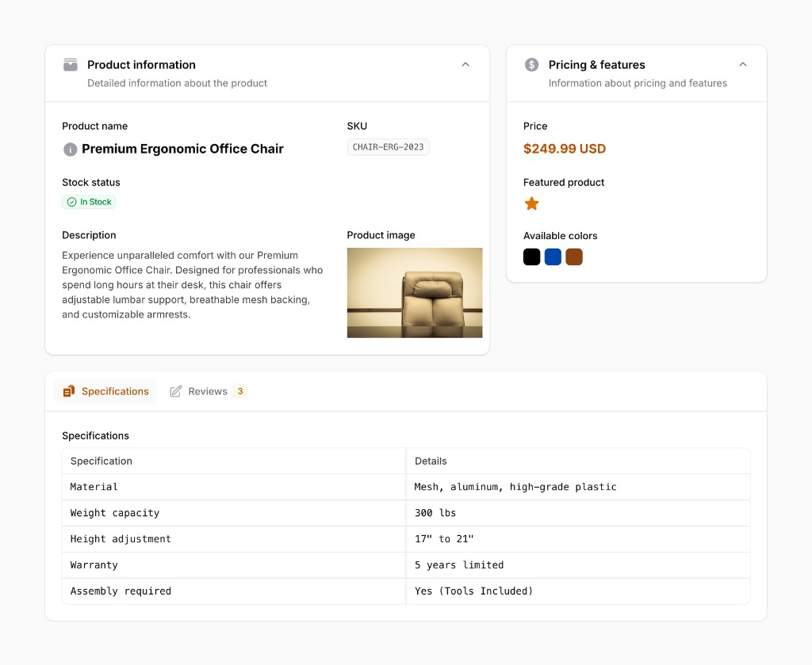

I checked the current Dyrected docs and public developer documentation. The public docs currently expose `defineCollection({...})` with field objects such as `{ name: 'title', type: 'text' }`; I could not verify a public `defineTextField()` API from the accessible docs, so I won't invent its signature. ([Dyrected][1])

For the feature document below, I’ll therefore keep the **existing documented collection/field syntax exact**, and use the proposed `display*` API only for the new feature.

# Detail Views

## Overview

Dyrected currently provides List, Create, and Edit views for collections.

This feature adds a **Detail View**: a read-only view of an individual record.

The Detail View is not an Edit View with disabled inputs. It is a presentation layer designed to help users understand a record, inspect related content, and access appropriate record actions.

Dyrected's existing model is schema-driven: developers define collections and fields in TypeScript, and Dyrected generates the admin experience from that schema. Detail Views extend this model by allowing developers to define how a record should be presented. ([Dyrected][1])

---

# 1. Goals

Detail Views should:

* Provide a read-only view for individual records.
* Be defined inside the collection schema.
* Reuse the existing field definitions.
* Provide sensible automatic rendering for every field type.
* Allow developers to control layout and presentation.
* Support relationships and joins.
* Support computed values using JEXL.
* Respect existing collection and field-level access control.
* Require little configuration for simple collections.
* Allow progressively more control for complex collections.

The feature should remain focused on **presentation**, not application logic.

---

# 2. Collection API

A collection currently follows the existing Dyrected schema:

```ts
defineCollection({
  slug: 'posts',

  fields: [
    { name: 'title', type: 'text', required: true },
    { name: 'body', type: 'richText' },
    { name: 'author', type: 'relationship', collection: 'team' },
    {
      name: 'status',
      type: 'select',
      options: ['draft', 'published'],
    },
  ],

  access: {
    read: () => true,
    create: ({ user }) => user?.role === 'editor',
    update: ({ user }) => user?.role === 'editor',
    delete: ({ user }) => user?.role === 'admin',
  },

  detail: [
    // Detail schema
  ],
})
```

The existing `fields` configuration defines the content model.

The new `detail` configuration defines the presentation of a record.

---

# 3. Display Schema

The Detail View introduces a set of `display*` helpers.

The naming deliberately separates data definition from presentation:

```text
Field schema
    ↓
What data exists?

Display schema
    ↓
How should that data appear?
```

The initial display primitives are:

```ts
displaySection()
displayTabs()
displayGrid()
displayField()
displayRepeat()
displayComputed()
```

The `display*` naming should be used consistently for Detail View presentation helpers.

---

# 4. Basic Detail View

A simple Detail View can explicitly list fields:

```ts
detail: [
  displayField('title'),
  displayField('body'),
  displayField('author'),
]
```

Fields may also be grouped:

```ts
detail: [
  displaySection('Post', [
    displayField('title'),
    displayField('body'),
  ]),

  displaySection('Publishing', [
    displayField('status'),
    displayField('author'),
  ]),
]
```

---

# 5. Field Shorthand

The Detail schema may support field names directly as shorthand:

```ts
detail: [
  displaySection('Post', [
    'title',
    'body',
  ]),
]
```

This is equivalent to:

```ts
detail: [
  displaySection('Post', [
    displayField('title'),
    displayField('body'),
  ]),
]
```

The explicit `displayField()` form is preferred whenever presentation options are required.

---

# 6. Display Section & Layout

`displaySection()` groups related information.

```ts
displaySection('Post', [
  displayField('title'),
  displayField('coverImage'),
  displayField('excerpt'),
  displayField('body'),
])
```

A section supports:

* `span`: Number of columns (1–12) to occupy in the Detail View grid (default: `12`).
* `title`: Section heading.
* `description`: Optional helper copy below the heading.
* `collapsible`: Whether the section can be expanded/collapsed.
* `visible`: Conditional display rule (JEXL or function).

---

# 7. 12-Column Responsive Grid System

The Detail View layout is powered by a **12-column responsive grid system**.

Both top-level containers (like `displaySection`) and child fields use the same 12-column grid language. This provides complete layout freedom without introducing rigid abstractions like dedicated "sidebar" or "main" primitives.

## Multi-Column Sections (Main + Sidebar)

By setting `span` on sections, you can effortlessly create multi-column layouts (e.g. an 8-column main content area and a 4-column metadata sidebar):

```ts
detail: [
  // Main content area (8 of 12 columns)
  displaySection('Order Details', [
    displayField('orderNumber'),
    displayField('customerNotes'),
    displayRepeat('items', [...]),
  ], { span: 8 }),

  // Sidebar (4 of 12 columns)
  displaySection('Status & Fulfillment', [
    displayField('status'),
    displayField('assignedTo'),
    displayField('createdAt'),
  ], { span: 4 }),
]
```

## Grid Spans Inside Sections

Fields inside a section also use `span` out of 12 columns:

```ts
displaySection('Post Details', [
  displayField('title', { span: 8 }),
  displayField('slug', { span: 4 }),

  displayField('excerpt', { span: 12 }),
  displayField('coverImage', { span: 6 }),
  displayField('author', { span: 6 }),
])
```

## Responsive Breakpoints

The 12-column grid is responsive automatically. On tablet and mobile viewports, multi-column spans automatically collapse to 12 columns (full width stacked), preserving usability across screen sizes.

---

# 8. Display Tabs

Tabs allow large records to be separated into logical groups.

```ts
displayTabs([
  displayTab('Overview', [
    displayField('title'),
    displayField('coverImage'),
    displayField('excerpt'),
  ]),

  displayTab('Content', [
    displayField('body'),
  ]),

  displayTab('Publishing', [
    displayField('status'),
    displayField('author'),
    displayField('publishedAt'),
  ]),
])
```

`displayTab()` is a child primitive of `displayTabs()`.

---

# 9. Automatic Field Rendering

`displayField()` should not require developers to specify how a field is rendered in normal cases.

Dyrected already knows the field type.

For example:

```ts
{ name: 'title', type: 'text' }
```

should automatically render as text.

```ts
{ name: 'body', type: 'richText' }
```

should render the stored rich text.

```ts
{ name: 'coverImage', type: 'image' }
```

should render the image.

The Detail View should use the existing field definition as the source of truth.

---

# 10. Field Display Types

The default Detail renderer should support the existing Dyrected field types:

| Field          | Default Detail presentation |
| -------------- | --------------------------- |
| `text`         | Text                        |
| `textarea`     | Text                        |
| `richText`     | Rendered rich text          |
| `number`       | Formatted number            |
| `boolean`      | Boolean indicator           |
| `date`         | Formatted date              |
| `datetime`     | Formatted date/time         |
| `time`         | Formatted time              |
| `select`       | Selected option             |
| `radio`        | Selected option             |
| `multiSelect`  | Multiple values             |
| `email`        | Email                       |
| `url`          | Clickable URL               |
| `icon`         | Icon                        |
| `relationship` | Related record              |
| `join`         | Related records             |
| `array`        | Structured repeatable data  |
| `object`       | Nested data                 |
| `blocks`       | Rendered blocks             |
| `image`        | Image                       |
| `json`         | Formatted JSON              |

These are the existing field types documented by Dyrected. ([Dyrected][1])

---

# 11. Field Presentation & Formatting Options

`displayField()` automatically **inherits** labels, formatting rules, and options from the collection's field definition.

Developers specify the `display` option in `displayField()` to choose a specific presentational variant.

## Complete List of `display` Variants

| `display` Variant | Applicable Field Types | Description & Visual Output | Example |
| :--- | :--- | :--- | :--- |
| **`'text'`** *(default)* | `text`, `textarea`, `select` | Standard readable typography. | `"Premium Ergonomic Chair"` |
| **`'badge'`** | `select`, `radio`, `text`, `boolean` | Rounded pill badge with custom color mappings via `badgeColors`. | `[ ● In Stock ]`, `[ Published ]` |
| **`'code-badge'`** / `'code'` | `text`, `uuid` | Monospace code pill for identifiers, SKUs, and tokens. | `CHAIR-ERG-2023` |
| **`'copyable'`** | `text`, `email`, `url` | Text with a one-click clipboard copy button. | `api_live_98a72... [📋]` |
| **`'link'`** / `'url'` | `url`, `relationship` | Clickable hyperlink with external icon or record navigation. | [View Website ↗](https://example.com) |
| **`'email'`** | `email`, `text` | Clickable `mailto:` link with mail icon. | `✉ editor@dyrected.com` |
| **`'phone'`** | `text` | Clickable `tel:` link with phone icon. | `📞 +1 (555) 019-2834` |
| **`'currency'`** | `number` | Highlighted currency text with ISO symbol and decimal formatting. | `$249.99 USD`, `₦2,500,000 NGN` |
| **`'percent'`** | `number` | Formatted percentage value. | `85.4%` |
| **`'progress'`** | `number` | Visual horizontal progress bar (0–100%). | `████████░░ 80%` |
| **`'star'`** / `'star-rating'` | `number`, `boolean` | Visual star rating indicator. | `★ ★ ★ ★ ☆` (4/5) or `★` (featured) |
| **`'boolean'`** | `boolean` | Checkmark / Cross icon indicator or Yes/No text. | `✓ Yes` / `✕ No` |
| **`'date'`** | `date`, `datetime` | Localized calendar date. | `"Aug 18, 2026"` |
| **`'datetime'`** | `datetime` | Localized date and time. | `"Aug 18, 2026, 10:30 AM"` |
| **`'time'`** | `time`, `datetime` | Localized time only. | `"10:30 AM"` |
| **`'relative'`** | `date`, `datetime` | Human-readable relative timestamp. | `"3 hours ago"`, `"in 2 days"` |
| **`'image'`** | `image`, `url` | Image preview thumbnail with click-to-zoom lightbox. | Rendered photo thumbnail |
| **`'avatar'`** | `image`, `relationship` | Circular profile avatar with fallback initials. | `(👤 TB) Tunde Bakare` |
| **`'color-swatches'`** / `'color'` | `select`, `multiSelect`, `text` | Interactive visual color swatches. | `⬛ 🟦 🟫` |
| **`'icon'`** | `icon`, `text` | Renders a Lucide icon glyph by name. | `⭐`, `📦`, `🛡️` |
| **`'key-value'`** / `'table'` | `object`, `json` | 2-column key-value specification table. | 2-column specification table |
| **`'tags'`** / `'badges'` | `multiSelect`, `array` | Horizontal list of tag badges. | `[Design] [Ergonomics] [Office]` |
| **`'json'`** | `json`, `object` | Collapsible, syntax-highlighted JSON tree. | `{ "depth": 2 }` |

## Example Usage

```ts
// Status badge with color mapping
displayField('stockStatus', {
  display: 'badge',
  badgeColors: { inStock: 'emerald', lowStock: 'amber', outOfStock: 'rose' },
})

// SKU code badge
displayField('sku', {
  display: 'code-badge',
})

// Star rating
displayField('rating', {
  display: 'star',
})

// Color swatches
displayField('availableColors', {
  display: 'color-swatches',
})

// Currency formatting
displayField('price', {
  format: 'currency',
  currency: 'USD',
})

// Relative timestamp
displayField('publishedAt', {
  display: 'relative',
})

// Key-value specifications table
displayField('specifications', {
  display: 'key-value',
  keyLabel: 'Specification',
  valueLabel: 'Details',
})
```

## Label & Tooltip Overrides

```ts
displayField('author.name', {
  label: 'Written By',
  tooltip: 'Primary editorial author',
})
```

---

# 12. Empty and Null State Handling

When a field value is `null`, `undefined`, `""`, or an empty array `[]`, the Detail View handles the empty state cleanly:

## Default Behavior (En-Dash `—`)

By default, the field label is rendered with an en-dash placeholder (`—`). This preserves the vertical alignment of the grid and reassures editors that the field has loaded but has no value.

## Customizing Empty States

`displayField()` supports explicit empty-state configuration:

```ts
displayField('specialInstructions', {
  emptyText: 'No instructions provided', // Custom fallback placeholder
})

displayField('internalNotes', {
  hideIfEmpty: true, // Completely omits the field row if empty
})
```

---

# 13. Relationships

Relationships should have useful default Detail rendering.

Given:

```ts
defineRelationshipField({
  name: 'author',
  relationTo: 'team',
})
```

the Detail View should display the related record rather than only exposing its ID.

The related record should be navigable to its own Detail View when the current user has permission to read it.

Example:

```ts
displayField('author')
```

could render:

```text
Author

Busola Okeowo
Software Engineer

View record →
```

## Dotted Path Resolution (`displayField('author.name')`)

In addition to rendering a full relationship card, `displayField()` should support **dotted paths** to pluck and display individual fields from the related document:

```ts
displayField('author.name')
displayField('author.email')
displayField('author.avatar')
```

This differs intentionally from full relationship rendering and computed expressions:

| Syntax | Presentation |
| :--- | :--- |
| `displayField('author')` | Renders the complete relationship summary card/chip with navigation link. |
| `displayField('author.name')` | Renders just the `name` field using its type-aware field renderer (e.g. text). |
| `displayComputed('Author', { expression: 'doc.author.name' })` | Evaluates a raw JEXL string expression without field metadata. |

## Mechanics

1. **Automatic Population**: When the Detail View loader encounters a dotted path like `author.name`, it automatically requests population for `author` at query time.
2. **Schema & Renderer Resolution**: Dyrected inspects the target collection (`team`) to determine the field type and formatting options for `name`.
3. **Cross-Collection Access Control**: Field-level read permissions on the target collection are enforced. If the current user cannot read `team.name`, the field is not rendered.
4. **Label Resolution**: The label defaults to the target field's configured label (e.g. "Author Name" or "Name"), but can be overridden with display options.

---

# 14. Joins

Joins should render related records as structured data.

For example, a customer's Detail View could contain:

```text
Orders

Order      Status       Total
#1024      Paid         ₦185,000
#1018      Paid         ₦90,000
#1002      Cancelled    ₦50,000
```

A future display configuration may allow developers to define which fields of the joined collection appear.

```ts
displayField('orders', {
  display: 'table',
  fields: [
    'orderNumber',
    'status',
    'total',
  ],
})
```

The exact API for configuring related records should be finalized separately from the initial Detail View implementation.

---

# 15. Arrays and Objects

Array and object fields should be rendered using their existing field schemas as structured information rather than raw JSON.

For arrays/repeated fields, presentation of each item should be delegatable to a nested display schema.

For example, if the collection has:

```ts
{
  name: 'items',
  type: 'array',
  fields: [
    { name: 'product', type: 'text' },
    { name: 'quantity', type: 'number' },
    { name: 'price', type: 'number' },
  ],
}
```

One approach is delegating within `displayField()`:

```ts
displayField('items', {
  display: 'repeat',
  schema: [
    displayField('product'),
    displayField('quantity'),
    displayField('price'),
  ],
})
```

However, a dedicated **`displayRepeat()`** primitive provides a much cleaner abstraction:

```ts
displayRepeat('items', [
  displayField('product'),
  displayField('quantity'),
  displayField('price'),
])
```

Then the Detail schema reads naturally:

```ts
displaySection('Order items', [
  displayRepeat('items', [
    displayField('product'),
    displayField('quantity'),
    displayField('price'),
  ]),
])
```

And `displayRepeat()` can support layout options on child fields:

```ts
displayRepeat('items', [
  displayField('product', { span: 2 }),
  displayField('quantity'),
  displayField('price'),
])
```

## UI Presentation Layouts

`displayRepeat()` supports three distinct layout modes via `{ layout: 'table' | 'cards' | 'list' }`:

### 1. `table` (Default for flat scalar fields)

Renders a top header row with items displayed as horizontal rows with aligned columns. Best for structured line items.

```ts
displayRepeat('items', [
  displayField('product'),
  displayField('quantity'),
  displayField('price'),
], { layout: 'table' })
```

```text
Order items

┌──────────────────────────────────────────┐
│ Product          Quantity       Price     │
├──────────────────────────────────────────┤
│ Nike Shoes       2              ₦80,000   │
│ Socks            1              ₦25,000   │
└──────────────────────────────────────────┘
```

### 2. `cards` (For complex or multi-line repeated items)

Renders each item in an individual card container with distinct borders and internal labels. Best for rich items with images, notes, or nested fields.

```ts
displayRepeat('items', [
  displayField('product', { span: 12 }),
  displayField('quantity', { span: 6 }),
  displayField('price', { span: 6 }),
  displayField('notes', { span: 12 }),
], { layout: 'cards' })
```

```text
Order items

┌──────────────────────────────────────────┐
│ Nike Shoes                               │
│ Quantity: 2        Price: ₦80,000        │
│ Notes: Size 42, Blue edition             │
└──────────────────────────────────────────┘

┌──────────────────────────────────────────┐
│ Socks                                    │
│ Quantity: 1        Price: ₦25,000        │
│ Notes: Cotton crew                       │
└──────────────────────────────────────────┘
```

### 3. `list` (For lightweight items or activity lines)

Renders items as a borderless vertical list separated by subtle divider lines. Best for simple rows, tags, logs, or timeline-like data without heavy card wrapping.

```ts
displayRepeat('deliveries', [
  displayField('status'),
  displayField('timestamp'),
], { layout: 'list' })
```

```text
Delivery History

  • In Transit  — Jul 28, 2026 14:30
  ──────────────────────────────────────────
  • Dispatched  — Jul 27, 2026 09:15
  ──────────────────────────────────────────
  • Ordered     — Jul 26, 2026 18:00
```

## Conceptual Model

Adding `displayRepeat()` rounds out the display primitives:

```text
displaySection()
displayTabs()
displayGrid()
displayField()
displayRepeat()
displayComputed()
```

Where `displayRepeat()` is essentially:

> *"For every item in this array, render this display schema."*

That is much more powerful than making `displayField('items')` responsible for understanding every possible array presentation.

## Objects

Objects can be rendered as nested groups, individual targeted properties, or **structured key-value tables**.

### 1. Key-Value Table (`display: 'key-value'`)

For objects or JSON dictionaries that store attribute pairs (like technical specifications, metadata, or settings), `displayField()` can render a clean 2-column key-value table:

```ts
displayField('specifications', {
  display: 'key-value',
  keyLabel: 'Specification', // Defaults to "Key" or field label
  valueLabel: 'Details',       // Defaults to "Value"
})
```

```text
Specifications

┌────────────────────────┬──────────────────────────────────────────┐
│ Specification          │ Details                                  │
├────────────────────────┼──────────────────────────────────────────┤
│ Material               │ Mesh, aluminum, high-grade plastic       │
│ Weight capacity        │ 300 lbs                                  │
│ Height adjustment      │ 17" to 21"                               │
│ Warranty               │ 5 years limited                          │
│ Assembly required      │ Yes (Tools Included)                     │
└────────────────────────┴──────────────────────────────────────────┘
```

* **Schema-Defined Objects**: If the field uses `defineObjectField({...})` with defined subfields, the left column automatically uses the human-readable `label` of each child field.
* **Dynamic JSON Dictionaries**: If the field is unstructured JSON, keys are automatically formatted (e.g. `weightCapacity` $\rightarrow$ *"Weight capacity"*).

### 2. Dotted Path Targeting

Individual nested properties within an `object` field can also be targeted directly anywhere in the Detail layout:

```ts
displayField('address.street')
displayField('address.city')
displayField('address.country')
```

---

# 16. Rich Text

Rich text should be rendered as content rather than exposing its underlying editor representation.

A field defined as:

```ts
defineRichTextField({
  name: 'body',
})
```

should render the stored rich text in read-only form.

---

# 17. Images

Image fields should render visually.

```ts
displayField('coverImage')
```

should display the image rather than its underlying file reference.

Presentation options can eventually control:

* size
* aspect ratio
* alignment
* preview behavior

---

# 18. Computed Values

Detail Views should support computed values.

A computed value is information derived from the record rather than stored as a field.

Examples:

* Reading time
* Order total
* Number of related records
* Full name
* Display labels
* Percentages
* Derived statuses

## Dual-Execution Model (Cloud & Self-Hosted)

Following Dyrected's established design for access control and hooks, `displayComputed()` supports two execution styles:

### 1. Cloud-Safe JEXL Expressions (Serializable)

For Cloud schemas, expressions are serializable JEXL strings:

```ts
displayComputed('Reading time', {
  expression: 'math.ceil(doc.wordCount / 200) + " min"',
})
```

### 2. Self-Hosted Functions (TypeScript / JavaScript)

For self-hosted setups where code runs natively on the backend/server, `displayComputed()` can accept a custom calculation function directly:

```ts
displayComputed('Reading time', ({ doc }) => {
  const minutes = Math.ceil((doc.wordCount || 0) / 200);
  return `${minutes} min`;
})
```

Or with options:

```ts
displayComputed('Order Total', {
  compute: ({ doc }) => formatCurrency(doc.items.reduce((sum, item) => sum + item.price * item.quantity, 0)),
  span: 2,
})
```

---

# 19. JEXL Context & Math Module

For serializable Cloud expressions, JEXL evaluation should expose standard context and utility modules:

## Standard Context Variables

* `doc`: The current record (with access rules applied).
* `user`: The authenticated user (when applicable).

## Math Module (`math.*`)

To make calculations intuitive without arbitrary code execution, the JEXL environment provides a standard `math` module:

```ts
math.ceil(val)
math.floor(val)
math.round(val, decimals?)
math.abs(val)
math.min(...vals)
math.max(...vals)
math.pow(base, exp)
math.sqrt(val)
math.clamp(val, min, max)
```

Example in Detail Views:

```ts
displayComputed('Discounted Price', {
  expression: '"₦" + math.round(doc.price * (1 - doc.discountPercent / 100), 2)',
})
```

---

# 20. Built-in Helpers vs Custom Functions

## For Cloud

Additions to the declarative expression environment should be added as safe, shared helpers on `@dyrected/core`'s JEXL registry (e.g. `math.*`, string helpers like `slugify`, `truncate`, and date helpers like `formatDate`, `diffDays`).

## For Self-Hosted

Self-hosted configurations are not constrained by string serialization and can use native functions, custom libraries, external APIs, and full TypeScript typing.

---

# 21. Computed Value Security

Computed values must not bypass access control.

The conceptual evaluation order should be:

```text
Record
  ↓
Apply read access
  ↓
Accessible record
  ↓
Evaluate JEXL
  ↓
Display result
```

A user who cannot read a field should not be able to expose that field through a computed expression.

This is particularly important because Dyrected supports field-level access control. ([Dyrected][1])

---

# 22. Conditional Display

Detail components should eventually support conditional visibility using JEXL.

Example:

```ts
displayField('publishedAt', {
  visible: 'doc.status == "published"',
})
```

Or:

```ts
displaySection('Cancellation', [
  displayField('cancellationReason'),
], {
  visible: 'doc.status == "cancelled"',
})
```

Conditional visibility should use the same safe JEXL environment.

---

# 23. Automatic Detail View

A collection should not require a `detail` configuration.

If no Detail View is defined, Dyrected should generate a useful default Detail View from the collection's fields.

For example:

```ts
defineCollection({
  slug: 'posts',

  fields: [
    defineTextField({ name: 'title', required: true }),
    defineRichTextField({ name: 'body' }),
    defineSelectField({
      name: 'status',
      options: ['draft', 'published'],
    }),
  ],
})
```

should still produce a usable Detail View.

The automatic view should:

* Render readable fields.
* Use the appropriate field renderer.
* Respect access control.
* Format values appropriately.
* Handle relationships.
* Handle nested data.
* Provide standard record actions.

---

# 24. Progressive Configuration

The API should support progressive control.

## Automatic

```ts
defineCollection({
  slug: 'posts',
  fields: [
    // ...
  ],
})
```

## Explicit fields

```ts
detail: [
  displayField('title'),
  displayField('body'),
  displayField('author'),
]
```

## Grouping

```ts
detail: [
  displaySection('Post', [
    displayField('title'),
    displayField('body'),
  ]),

  displaySection('Publishing', [
    displayField('status'),
    displayField('author'),
  ]),
]
```

## Layout

```ts
detail: [
  displaySection('Post', [
    displayField('title', { span: 8 }),
    displayField('coverImage', { span: 4 }),
    displayField('body', { span: 12 }),
  ], { span: 8 }),

  displaySection('Publishing', [
    displayField('status'),
  ], { span: 4 }),
]
```

## Computed presentation

```ts
detail: [
  displaySection('Summary', [
    displayField('title'),

    displayComputed('Reading time', 'math.ceil(doc.wordCount / 200) + " min"'),
  ]),
]
```

The common case should remain simple.

---

# 25. Access Control

Detail Views must respect existing collection and field-level access control.

A configured field that the current user cannot read must not be rendered.

This applies to:

* normal fields
* nested fields
* relationships
* joins
* computed values

Detail configuration must never override access control.

Dyrected already supports collection-level and field-level access rules. ([Dyrected][1])

---

# 26. Record Header & Actions

The Detail View header is **automatic by default**, requiring zero extra configuration.

## Header Title and Metadata

* The primary record title is resolved automatically from `admin.useAsTitle` configured on the collection (consistent with Filament PHP and Dyrected List/Edit views).
* Subtitle metadata (such as timestamps or record ID) is displayed cleanly beneath the title.

## Header Actions

Standard record actions appear in the top-right header action group:

* **Back**: Returns to the previous view (e.g. List View).
* **Edit**: Navigates to the Edit View (visible only if user has `update` permission).
* **Delete**: Prompts for confirmation and deletes the record (visible only if user has `delete` permission).

Actions strictly respect existing access permissions. Custom record actions should be considered separately from the initial Detail View implementation.

---

# 27. Navigation

The expected collection flow becomes:

```text
List
  ↓
Detail
  ↓
Edit
```

After editing:

```text
Edit
  ↓
Detail
```

After deleting:

```text
Detail
  ↓
List
```

A record in the List View should open its Detail View when selected.

---

# 28. Example: Product Detail View

Below is a complete, production-ready example demonstrating the visual layout from our design reference:



```ts
import {
  defineCollection,
  defineTextField,
  defineNumberField,
  defineSelectField,
  defineBooleanField,
  defineImageField,
  defineObjectField,
  defineArrayField,
  displaySection,
  displayField,
  displayTabs,
  displayTab,
  displayRepeat,
} from '@dyrected/core';

export const Products = defineCollection({
  slug: 'products',
  admin: {
    useAsTitle: 'name',
    icon: 'package',
  },

  fields: [
    defineTextField({ name: 'name', label: 'Product name', required: true }),
    defineTextField({ name: 'sku', label: 'SKU', required: true }),
    defineSelectField({
      name: 'stockStatus',
      label: 'Stock status',
      options: ['inStock', 'lowStock', 'outOfStock'],
    }),
    defineTextField({ name: 'description', label: 'Description' }),
    defineImageField({ name: 'image', label: 'Product image' }),
    defineNumberField({ name: 'price', label: 'Price', required: true }),
    defineBooleanField({ name: 'featured', label: 'Featured product' }),
    defineSelectField({
      name: 'colors',
      label: 'Available colors',
      options: ['black', 'blue', 'brown'],
      hasMany: true,
    }),

    // Specifications Object
    defineObjectField({
      name: 'specifications',
      label: 'Specifications',
      fields: [
        defineTextField({ name: 'material', label: 'Material' }),
        defineTextField({ name: 'weightCapacity', label: 'Weight capacity' }),
        defineTextField({ name: 'heightAdjustment', label: 'Height adjustment' }),
        defineTextField({ name: 'warranty', label: 'Warranty' }),
        defineTextField({ name: 'assemblyRequired', label: 'Assembly required' }),
      ],
    }),

    // Reviews Array
    defineArrayField({
      name: 'reviews',
      label: 'Customer Reviews',
      fields: [
        defineTextField({ name: 'author', label: 'Author' }),
        defineNumberField({ name: 'rating', label: 'Rating' }),
        defineTextField({ name: 'comment', label: 'Review' }),
      ],
    }),
  ],

  detail: [
    // 📦 Section 1: Product Information (8 of 12 columns)
    displaySection('Product information', [
      displayField('name', { span: 7, tooltip: 'Detailed information about the product' }),
      displayField('sku', { span: 5, display: 'code-badge' }),

      displayField('stockStatus', {
        span: 12,
        display: 'badge',
        badgeColors: { inStock: 'emerald', lowStock: 'amber', outOfStock: 'rose' },
      }),

      displayField('description', { span: 7 }),
      displayField('image', { span: 5, display: 'image' }),
    ], {
      span: 8,
      icon: 'package',
      description: 'Detailed information about the product',
      collapsible: true,
    }),

    // 💲 Section 2: Pricing & Features (4 of 12 columns)
    displaySection('Pricing & features', [
      displayField('price', { format: 'currency', currency: 'USD' }),
      displayField('featured', { display: 'star' }),
      displayField('colors', { display: 'color-swatches' }),
    ], {
      span: 4,
      icon: 'circle-dollar-sign',
      description: 'Information about pricing and features',
      collapsible: true,
    }),

    // 📑 Section 3: Specifications & Reviews Tabs (12 of 12 columns)
    displayTabs([
      // Tab 1: Key-Value Specifications Table
      displayTab('Specifications', [
        displayField('specifications', {
          display: 'key-value',
          keyLabel: 'Specification',
          valueLabel: 'Details',
        }),
      ], { icon: 'file-text' }),

      // Tab 2: Customer Reviews with Live Count Badge
      displayTab('Reviews', [
        displayRepeat('reviews', [
          displayField('author', { span: 6 }),
          displayField('rating', { span: 6, display: 'star' }),
          displayField('comment', { span: 12 }),
        ], { layout: 'cards' }),
      ], {
        icon: 'message-square',
        badge: 'count(doc.reviews)',
      }),
    ]),
  ],
});
```

---

# 29. Initial API

The first version should introduce:

```ts
displaySection()
displayTabs()
displayTab()
displayGrid()
displayField()
displayRepeat()
displayComputed()
```

And support:

```ts
// Sections with 12-column grid spans
displaySection('Title', [...], { span: 8 })

// Fields with options and formatting
displayField('fieldName')
displayField('relationship.field', { label: 'Custom Label' })
export type DisplayVariant =
  | 'text'
  | 'badge'
  | 'code-badge'
  | 'code'
  | 'copyable'
  | 'link'
  | 'url'
  | 'email'
  | 'phone'
  | 'currency'
  | 'percent'
  | 'progress'
  | 'star'
  | 'star-rating'
  | 'boolean'
  | 'date'
  | 'datetime'
  | 'time'
  | 'relative'
  | 'image'
  | 'avatar'
  | 'color'
  | 'color-swatches'
  | 'icon'
  | 'key-value'
  | 'table'
  | 'tags'
  | 'badges'
  | 'json';

export interface DisplayFieldOptions {
  label?: string;
  tooltip?: string;
  span?: 1 | 2 | 3 | 4 | 5 | 6 | 7 | 8 | 9 | 10 | 11 | 12;
  display?: DisplayVariant;
  format?: 'currency' | 'date' | 'datetime' | 'relative' | 'number' | 'percent';
  currency?: string;
  badgeColors?: Record<string, string>;
  keyLabel?: string;
  valueLabel?: string;
  emptyText?: string;
  hideIfEmpty?: boolean;
}

export function displayField(
  fieldName: string,
  options?: DisplayFieldOptions
): DetailField;

// Repeat with layout modes (table, cards, list)
displayRepeat('fieldName', [
  displayField('childField'),
], { layout: 'table' }) // 'table' | 'cards' | 'list'

// Computed values (shorthand or options)
displayComputed('Label', 'math.ceil(doc.count / 10)')
displayComputed('Label', { expression: '...', span: 6 })
displayComputed('Label', ({ doc }) => `${doc.count}`)
```

The exact option types should be finalized during implementation based on the existing Dyrected schema/type architecture.

---

# 30. Initial Release Scope

## Detail View

* [ ] Detail route
* [ ] Record loading
* [ ] Read-only rendering
* [ ] List → Detail navigation
* [ ] Edit action
* [ ] Delete action
* [ ] Back navigation

## Display schema

* [ ] `detail`
* [ ] `displaySection` (with 12-column grid span)
* [ ] `displayTabs`
* [ ] `displayTab`
* [ ] `displayGrid`
* [ ] `displayField` (with span, format, emptyText, hideIfEmpty)
* [ ] `displayRepeat` (with `table`, `cards`, and `list` layouts)
* [ ] `displayComputed` (shorthand, options, and self-hosted functions)
* [ ] Dotted path field resolution (e.g. `author.name`, `address.city`)
* [ ] Field shorthand
* [ ] Automatic header title and metadata from `admin.useAsTitle`
* [ ] Empty and null state rendering (en-dash `—` default)

## Field rendering

* [ ] text
* [ ] textarea
* [ ] richText
* [ ] number
* [ ] boolean
* [ ] date
* [ ] datetime
* [ ] time
* [ ] select
* [ ] radio
* [ ] multiSelect
* [ ] email
* [ ] url
* [ ] icon
* [ ] relationship
* [ ] join
* [ ] array
* [ ] object
* [ ] blocks
* [ ] image
* [ ] json

## Computed values

* [ ] JEXL evaluation
* [ ] Standard context (`doc`, `user`)
* [ ] `math.*` standard module
* [ ] Self-hosted compute functions
* [ ] Read-only evaluation
* [ ] Access-control-safe evaluation

---

# 31. Future Scope

Potential future additions:

* Conditional visibility
* Collapsible sections
* Relationship cards
* Configurable relationship tables
* Custom display variants
* Reusable display schemas
* Custom record actions
* Activity/history
* Timelines
* Charts
* Statistics
* Custom display components

These should be driven by actual use cases rather than included in the initial implementation.

---

# 32. Detail Views for Globals

Detail Views apply to **Globals**, with a refined singleton lifecycle model.

## The Architectural Distinction

```text
Collection
→ many records
→ List → Detail → Edit

Global
→ one singleton document
→ Detail → Edit
```

Collections represent multi-record datasets where a user selects an entry from a table/list before inspecting or editing it. In contrast, a Global represents a single stateful document (e.g., Site Settings, Navigation, Header, Footer, Analytics Configuration).

## Schema Definition

The Global schema follows the exact same field-definition model as collections, providing a parallel `detail` API:

```ts
defineGlobal({
  slug: 'siteSettings',
  label: 'Site Settings',

  fields: [
    { name: 'siteName', type: 'text', required: true },
    { name: 'logo', type: 'relationship', relationTo: 'media' },
    { name: 'description', type: 'textarea' },
    { name: 'twitter', type: 'text' },
    { name: 'instagram', type: 'text' },
    { name: 'linkedin', type: 'text' },
  ],

  detail: [
    displaySection('General Information', [
      displayField('siteName', { span: 8 }),
      displayField('logo', { span: 4, display: 'image' }),
      displayField('description', { span: 12 }),
    ], { span: 8 }),

    displaySection('Social & Presence', [
      displayField('twitter', { span: 6, display: 'copyable' }),
      displayField('instagram', { span: 6, display: 'copyable' }),
      displayField('linkedin', { span: 6, display: 'copyable' }),
      displayComputed('Configured Accounts', {
        expression: 'count([doc.twitter, doc.instagram, doc.linkedin])',
        span: 6,
      }),
    ], { span: 4 }),
  ],
})
```

## Why Detail Views for Globals are Valuable

Globals often contain complex configurations and settings that are **much easier to comprehend as a composed dashboard page** than as a raw, unbounded editing form.

For example:

```text
Site Settings

┌──────────────────────────────────────┐  ┌──────────────────────────────────────┐
│ General Information                  │  │ Social & Presence                    │
│                                      │  │                                      │
│ Site Name       Dyrected CMS         │  │ Twitter         @dyrected            │
│ Logo            [media image]        │  │ Instagram       @dyrected            │
│ Description     Headless CMS...      │  │ LinkedIn        dyrected-cms         │
└──────────────────────────────────────┘  │ Configured      3                    │
                                          └──────────────────────────────────────┘
```

## Navigation & UX Lifecycle

For Globals, **Detail is the default landing experience**:

```text
Collection ───► List ───► Detail ───► Edit

Global     ───► Detail ───► Edit
```

1. **Navigation Entry**: Selecting a Global in the sidebar navigates directly to `/globals/:slug` (rendering its Detail View).
2. **Action Bar**: Displays the Global title, metadata, last updated time, and a primary **"Edit"** button.
3. **Editing Mode**: Clicking "Edit" switches to the editor form (`/globals/:slug/edit`), where saving or clicking the "Back" button seamlessly returns to the Global Detail View (`/globals/:slug`).
4. **Unified Presentation Engine**: The exact same `display*` primitives (`displaySection`, `displayGrid`, `displayField`, `displayTabs`, `displayTab`, `displayRepeat`, `displayComputed`) and renderer components power both Collections and Globals, ensuring zero code duplication.

---

# 33. Design Principle

The Detail View should extend the core Dyrected model:

```text
Schema
  ↓
List
Create
Edit
Detail
```

The developer defines the content structure once.

Dyrected uses that structure to generate the editing and reading experience.

The developer should only need to describe additional presentation when the automatically generated experience is not sufficient.

The central distinction is:

```text
Field schema
    ↓
What data exists?

Display schema
    ↓
How should the data be presented?
```

This keeps Detail Views inside Dyrected's existing schema-first philosophy rather than creating a separate admin UI system.

Dyrected's core product already positions the schema as the source of truth for content structure and the generated admin experience. Detail Views extend that same model to individual-record presentation. ([Dyrected][1])

[1]: https://www.dyrected.com/features/developers "Dyrected — The Headless CMS for Modern Developers"
