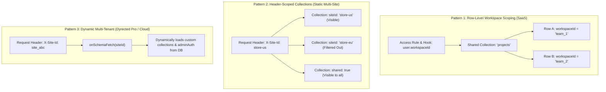
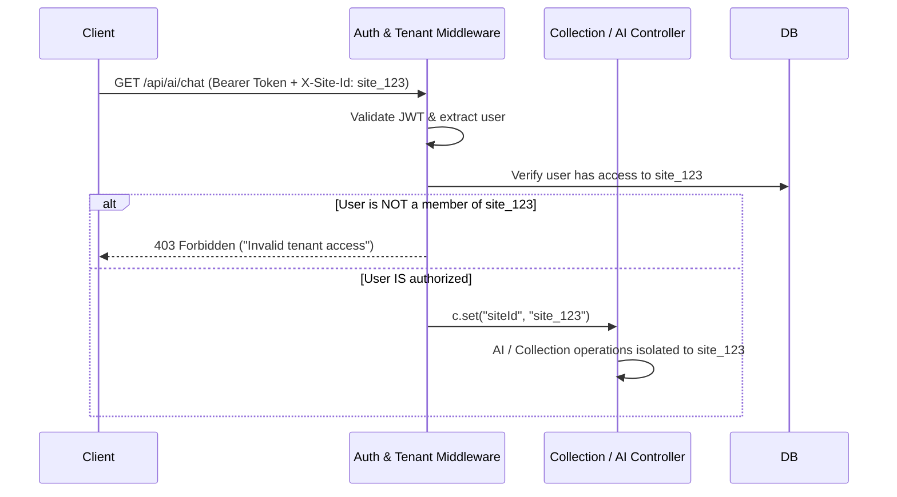

Searched for "x-site-id"
Viewed router.ts:235-260
Viewed router.ts:840-930
Viewed collection.controller.ts:635-660
Searched for "siteId"
Searched for "siteId"
Searched for "x-site-id"
Viewed config.ts:370-445
Searched for "multi-tenant"
Searched for "tenant"
Viewed __multi-tenant.mdx:1-4
Viewed tenant-scoped-access.mdx:1-87

In Dyrected today, **multi-tenancy actually exists across three distinct architectural patterns**, but it has never been unified into a coherent guide. In fact, [`apps/docs/.../__multi-tenant.mdx`](file:///Users/busola/Work/dyrected/apps/docs/content/docs/deployment-and-operations/plugins-and-extensions/__multi-tenant.mdx) is currently an empty 4-line stub.

Here is exactly what multi-tenancy looks like in Dyrected, how `X-Site-Id` works, where the current vulnerabilities lie, and how we should document it for developers.

---

### The 3 Multi-Tenant Patterns in Dyrected

Depending on what a developer is building, Dyrected supports three tiers of tenant isolation:



---

#### 1. Pattern 1: Row-Level / Workspace Scoping (SaaS Products)

* **Who it's for:** A developer building a B2B SaaS (e.g. Jira, Shopify apps, CRM) where all tenants share the same table schema, but each company only sees their own rows.
* **How it works:**
  * Documents contain a `workspaceId` or `tenantId` field.
  * An `access.read`, `access.update`, and `access.delete` rule returns a query constraint:

    ```ts
    access: {
      read: ({ user }) => user?.workspaceId ? { workspaceId: { equals: user.workspaceId } } : false,
      create: ({ user }) => Boolean(user?.workspaceId),
      update: ({ user }) => user?.workspaceId ? { workspaceId: { equals: user.workspaceId } } : false,
    }
    ```

  * A `beforeChange` hook guarantees the tenant field cannot be forged:

    ```ts
    hooks: {
      beforeChange: [
        ({ data, operation, user }) => {
          if (operation === 'create') return { ...data, workspaceId: user.workspaceId };
          return data;
        },
      ],
    }
    ```

---

#### 2. Pattern 2: Static Site Scoping via `X-Site-Id` (Multi-Site / Multi-Brand)

* **Who it's for:** An agency or enterprise managing 10 regional sites or sub-brands from one codebase.
* **How it works:**
  * In `dyrected.config.ts`, collections and globals declare which site they belong to, or if they are shared:

    ```ts
    export const USProducts = defineCollection({
      slug: 'us-products',
      siteId: 'site-us',
      fields: [...],
    });

    export const GlobalTaxonomies = defineCollection({
      slug: 'categories',
      shared: true, // Visible to all sites
      fields: [...],
    });
    ```

  * When the frontend or SDK makes requests, it passes `X-Site-Id: site-us`:

    ```ts
    const sdk = new DyrectedSDK({
      baseUrl: 'https://cms.example.com',
      siteId: 'site-us', // Automatically sends 'X-Site-Id' header on all calls
    });
    ```

  * Dyrected's [router.ts](file:///Users/busola/Work/dyrected/packages/core/src/router.ts#L268) filters schemas on `/api/schemas`:

    ```ts
    .filter((col) => !siteId || col.shared || !col.siteId || col.siteId === siteId)
    ```

---

#### 3. Pattern 3: Dynamic Schema Multi-Tenancy via `onSchemaFetch(siteId)` (Dyrected Pro / Cloud)

* **Who it's for:** Multi-tenant platforms (like Dyrected Cloud itself) where thousands of customers define their own completely custom collections and schemas stored in a database.
* **How it works:**
  * The root config registers the `onSchemaFetch` lifecycle callback:

    ```ts
    export default defineConfig({
      db: postgresAdapter({ ... }),
      onSchemaFetch: async (siteId: string) => {
        // Fetch custom collections, globals, and auth settings for this siteId from DB
        const tenant = await loadTenantFromDb(siteId);
        return {
          collections: tenant.customCollections,
          adminAuth: tenant.customSsoConfig,
        };
      },
    });
    ```

  * When a request arrives with `X-Site-Id: site_123`, the catch-all router [router.ts:928](file:///Users/busola/Work/dyrected/packages/core/src/router.ts#L928) executes `onSchemaFetch(siteId)` and merges the dynamic collections on the fly.

---

### The Problem: Why `X-Site-Id` Needs Hardening Before Week 2

Currently in [ai.controller.ts](file:///Users/busola/Work/dyrected/packages/core/src/controllers/ai.controller.ts#L17):

```ts
const projectId = c.req.header("X-Site-Id") || c.get("siteId") || "default";
```

Because `X-Site-Id` is read directly from the client HTTP header without a tenant verification step:

1. **Header Spoofing Risk:** A logged-in user with an account on `site-A` can manually send `X-Site-Id: site-B`.
2. **AI RAG Cross-Contamination:** The vector search currently does:

   ```ts
   RAGService.search({ projectId: siteId, query: ... })
   ```

   If `siteId` is spoofed, the AI will pull document chunks and embeddings belonging to `site-B` into `site-A`'s chat context.
3. **Action Proposals:** The AI will stage actions (`_dyrected_ai_actions`) associated with `site-B`.

### How It *Should* Work (The Production Solution)

To make multi-tenancy truly developer-ready and secure for both the core CMS and the AI assistant:



1. **Server-Side Tenant Resolution Hook (`resolveTenant` / `tenantAccess`):**
   * Dyrected core should offer a declarative way to validate tenant membership:

     ```ts
     export default defineConfig({
       // ...
       multiTenant: {
         header: 'X-Site-Id',
         validateAccess: async ({ siteId, user }) => {
           return user?.allowedSites?.includes(siteId);
         },
       },
     });
     ```

2. **Context-first, Header-fallback:**
   * Controllers should **never** trust `c.req.header("X-Site-Id")` directly if an authenticated session exists. They should read `c.get("siteId")` populated by the verified tenant middleware.
3. **Turn `apps/docs/.../__multi-tenant.mdx` into a First-Class Guide:**
   * Explain the 3 patterns clearly so developers know whether they need **Row-level scoping** (most SaaS apps) or **`X-Site-Id` / `onSchemaFetch`** (multi-site platforms).

---

### Recommended Next Steps

1. **Document Multi-Tenancy:** Write the comprehensive guide in [`apps/docs/content/docs/deployment-and-operations/plugins-and-extensions/__multi-tenant.mdx`](file:///Users/busola/Work/dyrected/apps/docs/content/docs/deployment-and-operations/plugins-and-extensions/__multi-tenant.mdx) (covering the 3 patterns, `X-Site-Id`, SDK setup, and access rules).
2. **Harden Tenant Scoping in AI Controller:** Ensure `projectId` in [ai.controller.ts](file:///Users/busola/Work/dyrected/packages/core/src/controllers/ai.controller.ts) is verified against the user's tenant permissions before performing RAG searches or creating action proposals.

Shall we draft the multi-tenancy documentation first, or patch the tenant isolation in the AI controller?
