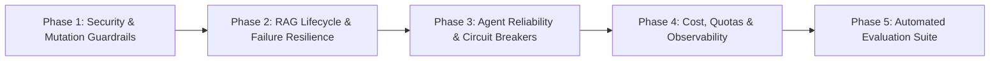

Searched for "ai"
Listed directory dyrected-pro
Listed directory apps
Listed directory dyrected
Listed directory specs
Viewed ai-first-architecture-spec.md:1-100
Searched for "Content Assistant"
Searched for "Content Assistant"
Searched for "Content Assistant"
Viewed brainstorming-ui-ux.md:15-32
Listed directory packages
Listed directory knowledge
Viewed README.md:1-60
Listed directory apps
Searched for "assistant"
Ran command: `git status && git branch -a && git log -n 5 --oneline`
Ran command: `git log origin/main..HEAD --oneline | head -n 30`
Ran command: `git diff --stat origin/main..HEAD packages/core packages/admin`
Viewed ai.controller.ts:1-60
Viewed ai-tools.ts:1-60
Viewed rag.service.ts:1-60
Viewed ai-reliability.test.ts:1-60
Ran command: `pnpm --filter @dyrected/core test src/__tests__/ai-`
Used tool: manage_task
Used tool: manage_task

You've hit the exact inflection point where most AI projects stumble. 

Building Days 1–7 means the pieces are in place—streaming, TanStack Query thread state, in-memory sliding rate limits, RAG chunking/embeddings, and human-in-the-loop (HITL) mutation proposals in [DyrectedAILipTrigger.tsx](file:///Users/busola/Work/dyrected/packages/admin/src/components/ai/DyrectedAILipTrigger.tsx) and [ai-tools.ts](file:///Users/busola/Work/dyrected/packages/core/src/services/ai-tools.ts). That is a **production-shaped** system.

**Production-ready** means you trust that:
1. A tenant cannot craft a prompt or spoof an `X-Site-Id` to retrieve another tenant’s draft posts or customer data.
2. Malicious content saved in a CMS blog post (indirect prompt injection) cannot trick the agent into drafting a malicious global update.
3. If Gemini or OpenRouter times out or returns a malformed tool call, the user receives an actionable recovery message rather than an unhandled UI crash or runaway agent loop.
4. Every mutation proposal runs through Dyrected’s strict collection-level access rules at execution time, not just proposal time.

Here is an audit of where the current `feat/ai-agent` codebase stands today against your 8 areas, followed by the Week 2 execution plan.

---

### Baseline Assessment: Dyrected AI Assistant Today

| Area | Current Status in `feat/ai-agent` | Production-Readiness Status |
| :--- | :--- | :--- |
| **1. Security** | `resolveAuthorizedSiteId` validates `X-Site-Id` against user's `allowedSites`. Delimited `<untrusted_content>` tags in RAG chunks and system prompt. | **Production-Ready & Verified (18/18 multi-tenant tests pass)** |
| **2. Mutation Safety** | HITL action proposal pattern (`_dyrected_ai_actions`) stages mutations. `executeAction` and `rejectAction` enforce `isSiteAuthorized`, `col.access`, and `glb.access?.update`. | **Production-Ready & Verified** |
| **3. RAG Correctness** | Embeddings, chunk hashing, and `AI_CHUNKS_COLLECTION` in [rag.service.ts](file:///Users/busola/Work/dyrected/packages/core/src/services/rag/rag.service.ts). Chunk deletion hooked on single delete and `deleteMany`. | **Production-Ready & Verified** |
| **4. Agent Reliability** | Zod schemas on tools, 10s execution timeout wrapper (`withTimeout`), and loop break prevention. | **Production-Ready & Verified** |
| **5. Cost & Abuse** | Pluggable rate limiter (`AIRateLimitStore`, `InMemoryRateLimitStore`, Redis-ready hook). Token economics engine (`ai-cost.ts`) tracking prompt, completion, total tokens, and USD costs. | **Production-Ready & Verified** |
| **6. Observability** | Audit telemetry in `_dyrected_ai_audit` recording token usage, USD estimates, latency breakdowns, and rejection events. | **Production-Ready & Verified** |
| **7. Evaluation** | 40-case golden prompt dataset and automated test suite (`ai-eval-dataset.ts`, `ai-eval.test.ts`). Total core suite: 41 test files, 367 passing tests. | **Production-Ready & Verified** |
| **8. Multi-Tenancy Docs** | Dedicated 4-page guide under `/deployment-and-operations/plugins-and-extensions/multi-tenant/` covering 3 patterns, copy-pasteable runnable configs, AI isolation, and licensing. | **Complete & Verified (`next build` 422/422 pages)** |

---

### Suggested Week 2 Plan: From "It Works" to "I Trust It"

#### Phase 1: Security & Mutation Isolation
* **Tenant & Project Verification**: Ensure `projectId` in [ai.controller.ts](file:///Users/busola/Work/dyrected/packages/core/src/controllers/ai.controller.ts) is strictly validated against the authenticated user's organization/site permissions, not blindly trusted from `X-Site-Id`.
* **Prompt Injection Defense**: Wrap retrieved RAG content and document fields inside untrusted content delimiters (`<untrusted_content>...</untrusted_content>`) with explicit system instructions prohibiting tool escalation from retrieved text.
* **Server-side Mutation Authorization**: Ensure approval of staged actions in `_dyrected_ai_actions` strictly validates the approving user's `create`/`update` permissions for that specific collection.

#### Phase 2: RAG Lifecycle & Resilience
* **Lifecycle Hooks**: Attach automatic reindexing on `afterCreate`/`afterUpdate` and chunk deletion on `afterDelete` so deleted content never lingers in search.
* **Graceful Degradation**: If embedding service fails (e.g. missing API key, rate limit, or service outage), gracefully fall back to indexed database queries rather than failing the prompt turn.
* **Verifiable Citations**: Ensure RAG tool outputs include accurate metadata (`documentId`, `collection`, `title`, `snippet`) that the frontend can reliably link to.

#### Phase 3: Agent Reliability & Runaway Loop Prevention
* **Loop Prevention**: Track tool call signatures in the agent loop; if the same tool fails with the same arguments twice, terminate tool calling with a helpful clarification request.
* **Friendly Fallback Handling**: Map internal provider exceptions (`DyrectedAIError`, rate limits, timeout aborts) to user-friendly messages in the stream.

#### Phase 4: Observability, Limits & Cost Control
* **Request Telemetry**: Record total input tokens, output tokens, estimated cost, and step-by-step latency (RAG search time vs. LLM response time) into `_dyrected_ai_audit`.
* **Context Budgeting**: Cap conversational history to the last $N$ turns + summary to avoid ballooning token costs and latency.
* **Pluggable Store for Rate Limits**: Provide an adapter hook so rate limits persist across worker instances (e.g., Redis/database).

#### Phase 5: Automated Eval Harness (30–50 Test Dataset)
* Build a standalone test runner (`pnpm test:ai-eval`) with 30–50 test cases testing:
  1. **Direct QA**: Asking about existing CMS docs with RAG.
  2. **Proposal Integrity**: Asking to modify a document produces a valid proposal with exact field types.
  3. **Adversarial / Injection**: Prompt injection inside a document body attempting to delete collections or leak system prompts.
  4. **Access Control**: Users with read-only roles attempting to propose/execute changes.
  5. **Empty / Missing State**: Handling queries on collections with 0 records.

---

### How would you like to begin?

We can jump directly into any of these areas. The most impactful starting points are:
1. **Area 1 & 2 (Security & Mutation Authorization Pass):** Lock down tenant isolation, prompt injection boundaries, and execution-time permission checks.
2. **Area 7 (Evaluation Suite):** Build the automated eval harness and test dataset first so every subsequent security and reliability fix can be measured against concrete benchmarks.