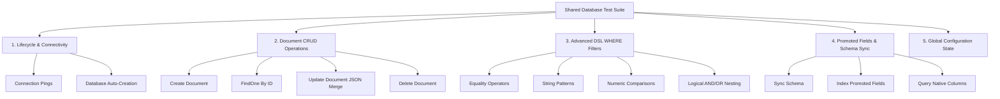

# Dyrected CMS - Comprehensive Database Adapter Testing Plan

To ensure absolute stability and complete feature parity across all database adapters, we must verify changes proactively in our local monorepo and CI/CD pipelines. This plan outlines a comprehensive, automated, and shared test suite designed to validate every adapter against identical specifications before release.

---

## 1. Core Philosophy: The Shared Test Suite

Since every Dyrected database adapter implements the same `DatabaseAdapter` interface from `@dyrected/core`, we can write a **single, shared, exhaustive test suite** in Vitest. 

By running the exact same test cases against all adapters, we guarantee:
1. **API Parity:** All adapters behave identically for the same input arguments.
2. **No Regression:** Changes to shared query parsers (e.g., `parseSqlWhere`) are validated across SQLite, Postgres, MySQL, and MongoDB instantly.
3. **Proactive Debugging:** Missing database auto-creations or parameter-binding issues are caught during local compilation—not by clients in production.

---

## 2. Test Environment Setup & Infrastructure

Each adapter requires a reliable test database instance. We will configure a unified local and CI testing environment using Docker Compose:

### Local Test Infrastructure (`docker-compose.test.yml`)
```yaml
version: '3.8'
services:
  test-postgres:
    image: postgres:15-alpine
    environment:
      POSTGRES_DB: dyrected_test
      POSTGRES_USER: root
      POSTGRES_PASSWORD: password
    ports:
      - "54322:5432"

  test-mysql:
    image: mysql:8
    environment:
      MYSQL_ROOT_PASSWORD: password
      MYSQL_DATABASE: dyrected_test
    ports:
      - "33062:3306"

  test-mongodb:
    image: mongo:6
    ports:
      - "27017:27017"
```

### Adapter Test Runners
* **SQLite:** Standard file or memory-based SQLite (`:memory:`) requires zero setup.
* **MongoDB:** Leverages local docker or `mongodb-memory-server` for instant, isolated test databases.
* **PostgreSQL & MySQL:** Connected to the designated test-ports above, resetting databases between runs.

---

## 3. Exhaustive Test Suite Matrix

The shared test suite runs through the following modules:



### Test Case Specifications

#### 1. Lifecycle & Connectivity
* **Test Case `db-exists`**: Verify that if the configured database does not exist, the adapter auto-creates it successfully (specifically testing Bug 2 on MySQL).
* **Test Case `ping-db`**: Ensure connection sanity check (`ping()`) returns `true` when active and fails gracefully with `false` when offline.

#### 2. Document CRUD Operations
* **Test Case `create`**: Inserts a raw document, returns correct schema, auto-generates `id`, and sets `createdAt` / `updatedAt` timestamps.
* **Test Case `findOne`**: Successfully retrieves the exact document by `id`. Returns `null` if the identifier does not exist.
* **Test Case `update`**: Updates specific fields inside the document using deep-merging principles (e.g., in MongoDB and Postgres, partial JSON updates must merge into the existing `data` block).
* **Test Case `delete`**: Removes the record completely, ensuring subsequent `findOne` calls return `null`.

#### 3. Advanced Querying & DSL Filters (`find()`)
This is the most critical suite, verifying Bug 3 (Postgres Parameter Binding) is completely resolved. It runs queries with the following `where` filters:
* **Equality:** `{ status: { equals: 'published' } }` and `{ status: { not_equals: 'draft' } }`.
* **Membership:** `{ category: { in: ['news', 'blogs'] } }` and `{ category: { not_in: ['events'] } }`.
* **Numeric Range:** `{ price: { gt: 10, lte: 100 } }`.
* **String Matching:** `{ title: { contains: 'hello' } }` and `{ slug: { starts_with: 'blog-' } }`.
* **Existence:** `{ publishedAt: { exists: true } }` and `{ archivedAt: { exists: false } }`.
* **Logical Nesting (AND/OR):** 
  ```typescript
  where: {
    OR: [
      { AND: [{ status: { equals: 'published' } }, { isFeatured: { equals: true } }] },
      { category: { equals: 'announcements' } }
    ]
  }
  ```

#### 4. Promoted Fields & Schema Sync (`sync()`)
* **Test Case `schema-sync`**: Promotes specific fields (e.g., `price` as `number`, `isFeatured` as `boolean`) into native database columns.
* **Test Case `column-queries`**: Executes the shared where-DSL query to verify filters against promoted columns behave identically to JSON path filters.

#### 5. Global State Settings
* **Test Case `globals`**: Validates global key/value store retrieval (`getGlobal()`) and transactional upserts (`updateGlobal()`).

---

## 4. Automation & CI/CD Integration

To ensure the test suite is running continuously without manual overhead, we will integrate it into our GitHub Actions Workflow:

```yaml
# .github/workflows/test.yml
name: Monorepo Database Integration Tests

on:
  push:
    branches: [ main, develop ]
  pull_request:
    branches: [ main, develop ]

jobs:
  test:
    runs-on: ubuntu-latest

    services:
      postgres:
        image: postgres:15-alpine
        env:
          POSTGRES_DB: dyrected_test
          POSTGRES_USER: root
          POSTGRES_PASSWORD: password
        ports:
          - 5432:5432
        options: >-
          --health-cmd pg_isready
          --health-interval 10s
          --health-timeout 5s
          --health-retries 5

      mysql:
        image: mysql:8
        env:
          MYSQL_ROOT_PASSWORD: password
          MYSQL_DATABASE: dyrected_test
        ports:
          - 3306:3306
        options: >-
          --health-cmd="mysqladmin ping"
          --health-interval 10s
          --health-timeout 5s
          --health-retries 5

    steps:
      - name: Checkout Repository
        uses: actions/checkout@v4

      - name: Install pnpm
        uses: pnpm/action-setup@v3
        with:
          version: 9.0.0

      - name: Install Node.js
        uses: actions/setup-node@v4
        with:
          node-version: 20
          cache: 'pnpm'

      - name: Install Dependencies
        run: pnpm install

      - name: Build Packages
        run: pnpm build

      - name: Run Adapter Tests
        run: pnpm --filter "@dyrected/core" test
