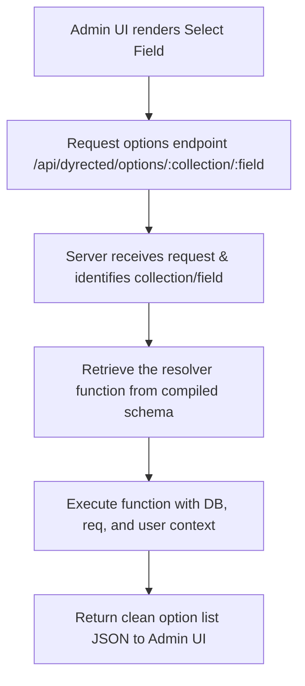

# Specification: Dynamic Option Queries

This specification outlines the architecture, configuration API, and implementation guidelines to allow `select` and `multiSelect` fields to dynamically populate their options from the database, other collections, or external SaaS APIs.

---

## 1. Context & Motivation

Currently, `select` and `multiSelect` fields require a static array of options inside the schema configuration:
```typescript
options: [
  { label: 'Draft', value: 'draft' },
  { label: 'Published', value: 'published' }
]
```

However, real-world admin portals need options that change dynamically, such as selecting from a list of active users, category tags from another database collection, or products fetched from an external Shopify or Stripe API.

This spec details how to define and resolve dynamic option lists securely.

---

## 2. Proposed Schema API

We propose allowing the `options` property on `select` and `multiSelect` fields to accept an async resolver function.

```typescript
export const Products = defineCollection({
  slug: 'products',
  fields: [
    {
      name: 'category',
      type: 'select',
      label: 'Category',
      // Dynamic option resolver function
      options: async ({ db, user }) => {
        const categories = await db.find({
          collection: 'categories',
          where: { active: { equals: true } }
        })
        return categories.map(c => ({
          label: c.name,
          value: c.id
        }))
      }
    },
    {
      name: 'supplier',
      type: 'select',
      label: 'External Supplier',
      options: async ({ env }) => {
        // Fetching options dynamically from an external SaaS API
        const response = await fetch('https://api.supplier.com/v1/list', {
          headers: {
            Authorization: `Bearer ${env.SUPPLIER_API_KEY}`
          }
        })
        const suppliers = await response.json()
        return suppliers.map(s => ({
          label: s.companyName,
          value: s.uuid
        }))
      }
    }
  ]
})
```

---

## 3. Server-Side Execution & Security

To prevent leaking sensitive database credentials, external API keys, or backend environments to the browser, **dynamic option query resolvers must execute strictly on the server**.

### The Resolution Pipeline



### The API Endpoint
The Dyrected core server will expose a dynamic options endpoint:
`GET /api/dyrected/options/:collection/:field`

#### Dependent Fields (Cascading Dropdowns)
The client-side Admin UI can pass sibling form values as query parameters:
`GET /api/dyrected/options/cities/state?country=ca`

The resolver function can access these parameters via `req` context:
```typescript
options: async ({ req, db }) => {
  const country = req.query.country || 'us'
  const states = await db.find({
    collection: 'regions',
    where: { country: { equals: country } }
  })
  return states.map(s => ({ label: s.name, value: s.code }))
}
```

---

## 4. Caching & Performance

Dynamic queries to third-party APIs can introduce latency in the Admin UI. To ensure high responsiveness:
* **Time-to-Live (TTL) Caching:** Enable schema developers to configure a cache duration (in seconds):
  ```typescript
  options: {
    resolve: async ({ db }) => { ... },
    cacheTTL: 300 // Cache options list for 5 minutes
  }
  ```
* **Search / Pagination:** For collections or datasets containing thousands of items, the resolver should support search parameters passed from the Admin UI select filter (e.g. `?search=App`).
