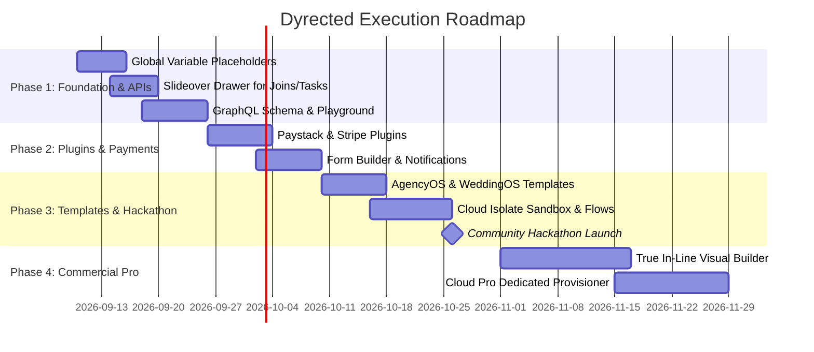

# Dyrected Feature Roadmap & Strategic Prioritization

**Document Version:** 4.0 (Commercial & Cloud Aligned)  
**Updated:** September 2026  
**Strategic Pillars:** Fast-Track Foundations $\rightarrow$ GraphQL & Payments $\rightarrow$ Turnkey Templates $\rightarrow$ Commercial Pro Features  

---

## 1. Executive Summary & Strategy Matrix

| Priority & Milestone | Core Capabilities | Monetization Tier | Complexity | Strategic Impact |
| :--- | :--- | :--- | :---: | :---: |
| 🥇 **Phase 1: Foundation & Core APIs** | Global Variable Tokens, In-Place Slideover Drawer, **GraphQL API Engine** | 🟢 **Open Source / Free** | **Low / Med** | **High (Core Adoption)** |
| 🥈 **Phase 2: Plugins & Payments** | Paystack & Stripe Checkout, Notifications (Resend/WhatsApp), Form Builder Plugin | 🟢 **Open Source Plugins** | **Medium** | **High (Essential Ops)** |
| 🥉 **Phase 3: Templates & Hackathon** | AgencyOS, WeddingOS, Visual Flows (Auto-Tasks), CLI Seeder, Cloud Sandbox | 🟢 / 💎 **Freemium Templates** | **Med / High** | **Transformative (Growth)** |
| 💎 **Phase 4: Commercial Pro Extensions** | True In-Line Visual Canvas Editing, White-Label Agency Branding, Dedicated Cloud | 💎 **Paid License ($299) / Cloud Pro ($29/mo)** | **High** | **Revenue Engine 💰** |

---

## 2. Why GraphQL Fits in Phase 1 (Core Developer Engine)

### Why it was previously scheduled later:
In traditional CMS workflows, GraphQL is an *alternative transport layer*—REST already functions for all CRUD operations, and non-technical content editors interact exclusively with the GUI without knowing whether REST or GraphQL is running underneath.

### Why it makes sense to build now (Phase 1):
1. **Developer Mindshare & Headless Parity:** Modern frontend developers (Next.js/React/Vue) and mobile teams strongly favor GraphQL for zero over-fetching and typed queries.
2. **Schema-as-Code Advantage:** Since Dyrected already has strongly typed collection definitions in `DyrectedConfig`, auto-generating GraphQL AST types is straightforward and provides immediate end-to-end `@graphql-codegen` support.
3. **Parity with Directus & Payload:** Establishes Dyrected as a complete developer-first API platform on day one.

---

## 3. Commercial Open-Core & Paid Plugin Strategy

```
┌────────────────────────────────────────────────────────────────────────────────────────┐
│                                DYRECTED REVENUE ENGINE                                 │
│                                                                                        │
│   ┌────────────────────────────────────────────────────────────────────────────────┐   │
│   │ 🟢 FREE OPEN SOURCE (MIT on GitHub)                                            │   │
│   │   • Core Engine, REST & GraphQL APIs, Admin GUI with Side-by-Side Preview      │   │
│   │   • Global Variable Tokens, In-Place Drawer Editing                            │   │
│   │   • Community Plugins: Paystack, Stripe, Form Builder, Resend, SEO             │   │
│   └────────────────────────────────────────────────────────────────────────────────┘   │
│                                                                                        │
│   ┌────────────────────────────────────────────────────────────────────────────────┐   │
│   │ 💎 PRO COMMERCIAL EXTENSIONS (License Key / Cloud Pro)                         │   │
│   │   • 🎨 True In-Line Visual Website Editing (`@dyrected/plugin-visual-builder`) │   │
│   │   • ⚡ Visual Action Flows Pro Canvas (`@dyrected/plugin-flows-pro`)           │   │
│   │   • 🏢 White-Label Agency Branding (Custom domain & client portal logos)       │   │
│   │   • ☁️ Dyrected Cloud Pro ($29/mo) / Self-Hosted Commercial License ($299)     │   │
│   └────────────────────────────────────────────────────────────────────────────────┘   │
└────────────────────────────────────────────────────────────────────────────────────────┘
```

---

## 4. Phase-by-Phase Roadmap & Architecture Specs

---

### 🥇 Phase 1: Foundation, Drawer UX & GraphQL API (Weeks 1–2)

1. **Global Variable Placeholders & Dynamic Interpolation**  
   📄 [global-variable-placeholders-spec.md](file:///Users/busola/Work/dyrected/specs/future/global-variable-placeholders-spec.md)  
   * Write `{{ globals.pricing.pro }}` in FAQs and dynamic lists; updates everywhere instantly when global settings change.
2. **In-Place Slideover (Sheet/Drawer) Editing for Joins & Tasks**  
   📄 [drawer-slideover-relation-editing-spec.md](file:///Users/busola/Work/dyrected/specs/future/drawer-slideover-relation-editing-spec.md)  
   * The AgencyOS pattern: click sub-tasks in a project to edit them in a slide-over panel on the same page.
3. **GraphQL Dynamic Schema & Endpoint (`/api/graphql`)**  
   📄 [graphql-api-spec.md](file:///Users/busola/Work/dyrected/specs/future/graphql-api-spec.md)  
   * Auto-generated GraphQL AST schema, DataLoader relational batching, and embedded GraphiQL Playground.

---

### 🥈 Phase 2: Core Plugin Ecosystem & Payments (Weeks 3–4)

1. **Paystack & Stripe Payment Plugins (`@dyrected/plugin-paystack`, `@dyrected/plugin-stripe`)**  
   📄 [plugin-ecosystem-and-payment-gateways-spec.md](file:///Users/busola/Work/dyrected/specs/future/plugin-ecosystem-and-payment-gateways-spec.md)  
   * Checkouts, subscription webhooks, and drop-in `<PaymentButton />` blocks.
2. **Visual Form Builder Plugin & Form Block (`@dyrected/plugin-form-builder`)**  
   * Drag-and-drop form designer in Admin dashboard with embeddable `<FormBlock />`.
3. **Notification & SEO Plugins (`@dyrected/plugin-notifications`, `@dyrected/plugin-seo`)**  
   * Multi-channel alerts (Resend, WhatsApp, Twilio) and dynamic OpenGraph image previews.

---

### 🥉 Phase 3: Turnkey Templates, Cloud Sandbox & Hackathon Launch (Weeks 5–6)

1. **Turnkey Business OS Templates (AgencyOS, WeddingOS, CoachOS)**  
   📄 [marketplace-and-template-ecosystem-spec.md](file:///Users/busola/Work/dyrected/specs/future/marketplace-and-template-ecosystem-spec.md)  
   * Complete business backends and frontends (`npx @dyrected/create --template agency-os`).
2. **Cloud Code Sandboxing (`isolated-vm` / V8 Isolates)**  
   📄 [cloud-code-sandboxing-and-monetization-spec.md](file:///Users/busola/Work/dyrected/specs/future/cloud-code-sandboxing-and-monetization-spec.md)  
   * Safe multi-tenant JavaScript execution with strict CPU/memory limits for cloud users.
3. **Visual Flows & Action Automations Engine**  
   📄 [visual-flows-and-automations-spec.md](file:///Users/busola/Work/dyrected/specs/future/visual-flows-and-automations-spec.md)  
   * Auto-spawn project task checklists and client emails on form submission.
4. **🚀 Community Hackathon Kickoff & Creator Video Playbooks**

---

### 💎 Phase 4: Commercial Pro Extensions & Visual Builder (Post-Hackathon)

1. **True In-Line Visual Website Editing (`@dyrected/plugin-visual-builder`)**  
   📄 [inline-visual-editing-spec.md](file:///Users/busola/Work/dyrected/specs/future/inline-visual-editing-spec.md)  
   * Proprietary paid plugin for canvas on-page editing. Included for free in Cloud Pro ($29/mo) or available as a standalone self-hosted license ($299).
2. **White-Label Agency Branding & Dedicated Cloud Containers**  
   * Automated 1-click provisioning of dedicated Fly.io micro-VMs for high-volume Cloud Pro customers.

---

## 5. Execution Schedule & Milestones


